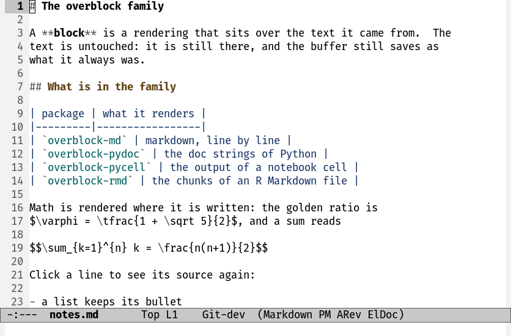
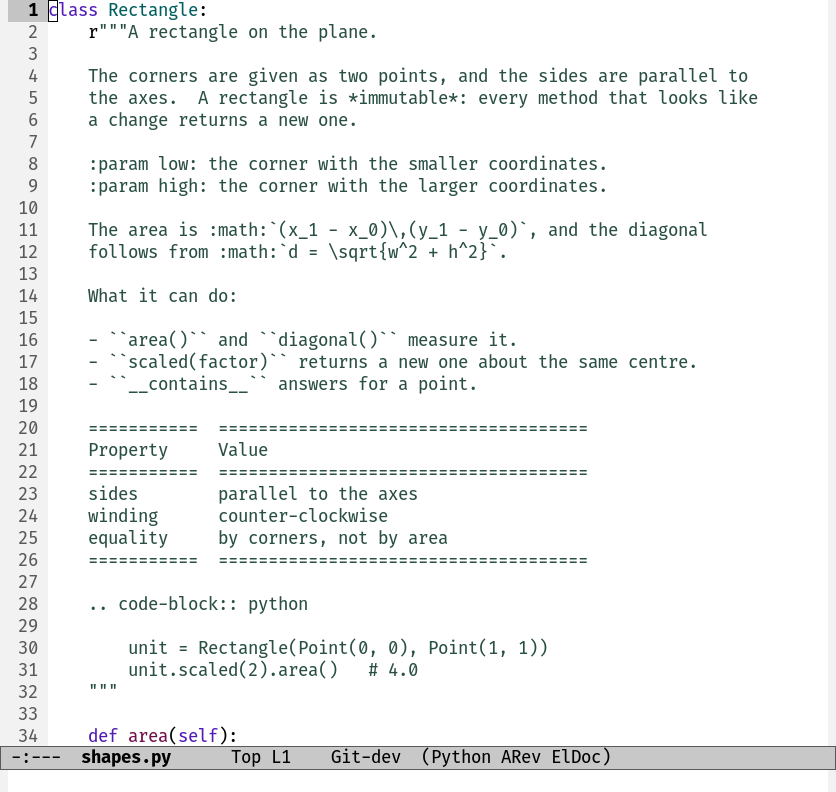
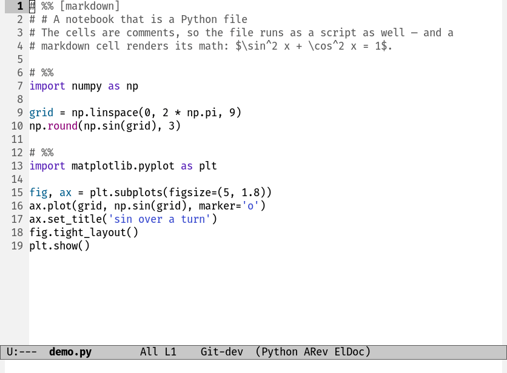
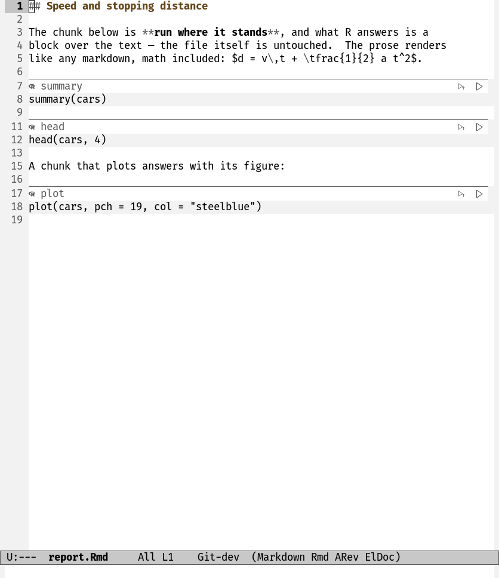

# Inspired by: https://github.com/othneildrew/Best-README-Template
#+OPTIONS: toc:nil

[[https://github.com/MArpogaus/overblock/graphs/contributors][https://img.shields.io/github/contributors/MArpogaus/overblock.svg?style=flat-square]]
[[https://github.com/MArpogaus/overblock/network/members][https://img.shields.io/github/forks/MArpogaus/overblock.svg?style=flat-square]]
[[https://github.com/MArpogaus/overblock/stargazers][https://img.shields.io/github/stars/MArpogaus/overblock.svg?style=flat-square]]
[[https://github.com/MArpogaus/overblock/issues][https://img.shields.io/github/issues/MArpogaus/overblock.svg?style=flat-square]]
[[https://github.com/MArpogaus/overblock/blob/main/COPYING][https://img.shields.io/github/license/MArpogaus/overblock.svg?style=flat-square]]
[[https://github.com/MArpogaus/overblock/actions/workflows/test.yml][https://img.shields.io/github/actions/workflow/status/MArpogaus/overblock/test.yml.svg?branch=main&label=tests&style=flat-square]]
[[https://linkedin.com/in/MArpogaus][https://img.shields.io/badge/-LinkedIn-black.svg?style=flat-square&logo=linkedin&colorB=555]]

* overblock :TOC_3_gh:noexport:
  - [[#about-the-project][About The Project]]
  - [[#which-one-do-you-want][Which One Do You Want]]
  - [[#overblock-the-block-layer][overblock: the block layer]]
  - [[#overblock-md-markup-rendered-to-text][overblock-md: markup rendered to text]]
  - [[#overblock-pydoc-python-doc-strings][overblock-pydoc: Python doc strings]]
  - [[#overblock-pycell-python-notebook-cells][overblock-pycell: Python notebook cells]]
  - [[#overblock-rmd-r-chunks-in-an-rmd-file][overblock-rmd: R chunks in an Rmd file]]
  - [[#prerequisites][Prerequisites]]
  - [[#known-limits][Known Limits]]
  - [[#development][Development]]
  - [[#contributions][Contributions]]
  - [[#license][License]]
  - [[#contact][Contact]]

** About The Project

One idea, five packages: a *block* shows text over a region of a
buffer, or after it, and the buffer text does not change.  Files, undo
and a language server see nothing.

A block is dealt out a piece to a line, so a tall rendering scrolls
like text rather than jumping past in one step.  That is the whole
trick, and everything here is a caller of it: markup rendered where it
is written, Python doc strings read as prose, the output of a Python
cell shown under the cell, the output of an R chunk shown under the
chunk.

[[file:img/demo.gif]]

The four modes of the family, one after the other: a Markdown file
rendered over its own source, the doc strings of a Python module, a
=# %%= notebook with its results, and the R chunks of an =.Rmd= file.

The packages install one at a time out of this one repository.  Each
has a main file of its own carrying its version and its dependencies,
and each recipe names that package's files.

** Which One Do You Want

| Package            | What you get                                                | It needs                                |
|--------------------+-------------------------------------------------------------+-----------------------------------------|
| =overblock=        | the layer.  Nothing to turn on; a library for a caller.     | Emacs 29.1                              |
| =overblock-md=     | markup to a propertized string, and a Markdown preview mode | =overblock=                             |
| =overblock-pydoc=  | Python doc strings rendered in place                        | =overblock-md=                          |
| =overblock-pycell= | inline results for =# %%= Python cells                      | =overblock-md=, code-cells, comint-mime |
| =overblock-rmd=    | inline results for the R chunks of an =.Rmd= file           | =overblock-md=, ess                     |

Install the one you want and its dependencies come with it.  None of
them is on MELPA yet, so the recipes below name this repository; any
package manager that reads a MELPA style recipe takes the same
=:repo= and =:files=.  The snippets are written for
[[https://github.com/progfolio/elpaca][elpaca]] and =use-package=.

No package here installs a hook or binds a key.  An installation must
not change how Emacs behaves.

** overblock: the block layer

=overblock= puts a block on the screen and knows nothing about any
language, about cells or about markup.  A caller renders text and hands
it over:

#+begin_src emacs-lisp
  (overblock-show BEG END :kind 'result :body TEXT :header TEXT)
#+end_src

It also carries the run loop that both notebooks here share.  This
section shows no animation: the layer draws nothing of its own.

Install it on its own only to write such a caller; the four packages
below pull it in.

#+begin_src emacs-lisp
  (use-package overblock
    :ensure (overblock :host github :repo "MArpogaus/overblock"
                       :files ("overblock.el" "overblock-repl.el"
                               "overblock-run.el")))
#+end_src

*** A block

=overblock-show= takes a region and a plist, and returns the block:

#+begin_src emacs-lisp
  (overblock-show BEG END
                  :kind 'result          ; whose block this is
                  :data ANYTHING         ; what the caller keeps with it
                  :over TEXT             ; shown instead of the region
                  :body TEXT             ; shown after the region
                  :header TEXT           ; shown above the body
                  :hidden t              ; show nothing for now
                  :keymap MAP :help-echo STRING
                  :attached OVERLAYS)    ; the caller's own
#+end_src

- =:kind= tells the blocks of one caller from those of another.  A
  block without a kind is anonymous.
- =:data= is the caller's own.  The layer keeps it and never reads it.
- =:over= hangs on the lines of the region, a piece to a line.  A line
  with no piece left for it goes under a cloak.  This is what lets a
  tall rendering scroll like text.
- =:body= rides the newline that ends the region, and =:header= stands
  above it.

A new block replaces the blocks of its own kind in the same region.
The layer never calls a renderer.

| Function                      | What it does                                |
|-------------------------------+---------------------------------------------|
| =overblock-show=              | show a block, and return it                 |
| =overblock-get= / =-set=      | read and write a property of a block        |
| =overblock-refresh=           | show a block again from its properties      |
| =overblock-in= / =-at=        | the blocks of a region, or the one at point |
| =overblock-delete= / =-clear= | take one block down, or those of a region   |
| =overblock-sweep-orphans=     | remove what an edit left without an anchor  |
| =overblock-stale-when-edited= | take a block down on the next edit under it |
| =overblock-goto-event=        | select the window of a click and go there   |

A fold is =:hidden= plus =overblock-refresh=: everything a block shows
is made anew from its properties, so nothing has to be saved and given
back.

Images need care, because display properties do not nest.
=overblock-image-in= says whether a rendering holds one,
=overblock-image-cap= caps every image in it to
=overblock-image-height= of the window, and =overblock-image-label=
replaces the images with their labels for a terminal that draws none.
=overblock-flattened= turns the pixel space of another window into real
spaces, and =overblock-fill-props= writes properties only where the
rendering carries none of its own, so a link keeps its own keymap.

*** Bars, buttons and glyphs

A bar is a header line inside the buffer.  =overblock-bar= builds one
from a label, a group of icons and a face, and holds the icons at the
right window edge.  It is cut to the narrowest window that shows the
buffer.

A bar can also stand in place of a line, which is what a marker line
wants: =overblock-bar-over= makes the overlay and =overblock-bar-draw=
draws on it.  A draw where nothing has changed costs a comparison, so a
caller may draw from a change hook.  =overblock-bar-in=, =-bars= and
=-kind= find them again, and =overblock-bar-stale= makes one forget
what it was drawn from.

=overblock-buttons= turns a list of descriptors into the icon group.
Each descriptor is =(KEY GLYPHS HELP COMMAND WHEN)=.  GLYPHS are the
candidates for the label: the first one the frame can draw wins, and
the last one always answers, so keep a plain character at the end.
WHEN is =t=, or =image=, =lines= or =running= for a button that waits
for an image, for text, or for a block still being written.
=overblock-button-type= is the customize type of such a list, for a
caller that offers one as an option.

=overblock-glyph= asks the frame which of several candidates it can
draw.  A terminal is given the plain last candidate, because Emacs
cannot ask a terminal what its font holds; a reader whose terminal does
carry an icon font sets =overblock-terminal-glyphs=.

*** The live cycle

A mode that keeps a whole buffer rendered, and editable, needs three
answers only: which regions, what to render them with, and when.
=overblock-live-start= runs the rest:

#+begin_src emacs-lisp
  (overblock-live-start 'my-kind #'my-render-buffer 0.2)
#+end_src

The render function is called with no arguments, once at the start and
then whenever the reader stops moving.  It must leave alone what is
rendered already and the region point is in — the reader is editing
that one.  A rendering comes off when the reader clicks it
(=overblock-live-edit=) and when the text under it is edited.
=overblock-live-wanted-p= answers whether a region still wants one, and
=overblock-live-stop= ends the cycle and clears the buffer.

*** The edit buffer

=overblock-edit-in-buffer= opens the text under a block in a buffer of
its own, as =org-edit-special= opens a source block.  The caller says
what the buffer is called, which major mode it wears, how to read the
plain text out and how to write it back.  =overblock-edit-commit= and
=overblock-edit-abort= end the edit; they live in
=overblock-edit-mode-map=, which is empty.

Each region gets a buffer of its own, so several can be open at once.
An edit of the same region that is already under way is offered back
rather than replaced.

*** The output of a shell

What a shell prints is not what a block can show.  A copy of it carries
the keymap of the shell, alignment measured in another window, a live
vtable that belongs to that buffer, and images at whatever size they
came in.  =overblock-repl.el= cuts a copy loose from all of that:

#+begin_src emacs-lisp
  (overblock-repl-detach (buffer-substring beg end))
#+end_src

The columns of a table are laid out in characters, and the table keeps
its object under the =overblock-repl-table= text property, so a caller
can show it live elsewhere with =overblock-repl-table-copy=.
=overblock-repl-first-lines= takes the head of a long output without
reading the rest, and =overblock-repl-count-lines= counts it.  Capping
the images is the layer's part: =overblock-image-cap=.

This file needs =vtable=, which Emacs ships.

*** The run loop

A notebook is a buffer of regions and a shell to send them to.  Send
one, watch what the shell prints, wait for the prompt that says it is
done, and show what came back under the region it came from.  That loop
is the same whatever language is at the other end, so it lives here.
=overblock-run.el= holds the run state, the queue of a pass over the
buffer, the ticker that mirrors a running region five times a second,
the filter that waits for the prompt, and the result block itself.
Nothing in it knows a language: =overblock-pycell= sends Python cells
to an inferior Python and =overblock-rmd= sends R chunks to an
inferior R, and both are callers of this file.

Two plists say what a language is.  =overblock-run-backend= is the
shell.  A notebook's mode sets it in its own buffer, and a send copies
it into the shell buffer, where the filter and the ticker read it:

| Slot        | What it answers                                   |
|-------------+---------------------------------------------------|
| =:name=     | the word this notebook's messages carry           |
| =:process=  | the live shell process, or nil                    |
| =:start=    | start one, or nil where it will only prompt later |
| =:arm=      | run a thunk on the shell's first prompt           |
| =:send=     | send a region to the process                      |
| =:prompt-p= | whether what the shell printed ends at a prompt   |
| =:clean=    | the output as a block can show it                 |
| =:head=     | as much of the output as shows inline             |
| =:show=     | draw the result                                   |
| =:error-p=  | whether the region failed, which stops a pass     |
| =:step=     | run what is at point, and say whether to wait     |
| =:done=     | write the whole result into a follower's buffer   |

A *style* is the look of a result block, and =overblock-run-show=,
=overblock-run-update= and =overblock-run-header= take one as their
first argument: =:kind=, =:keymap=, =:buttons=, =:fold=,
=:header-face=, =:output-face=, =:lines= and =:chars=.  One style to a
package and not one to a buffer, so a block can be drawn with no mode
turned on.  The buttons and the two limits may be functions, which are
called when the block is drawn, so an option the reader has just
changed is read then.

| Function                         | What it does                                            |
|----------------------------------+---------------------------------------------------------|
| =overblock-run-region=           | run one region, and start the shell where there is none |
| =overblock-run-cells=            | run several in order, stopping at the first error       |
| =overblock-run-on-prompt=        | arm such a pass for a shell that has not prompted yet   |
| =overblock-run-show= / =-update= | draw a result, or draw it again                         |
| =overblock-run-output-head=      | the head of what a running region has printed           |
| =overblock-run-total=            | the lines it has printed, counted as they arrive        |
| =overblock-run-follow= / =-tick= | copy a running output into a buffer as it prints        |
| =overblock-run-abort=            | end a run whose prompt will never come                  |

The file has no options and no commands of its own.  Each package keeps
its own buttons, faces, limits and commands; what they share is every
line below them.

*** Commands and options

| Command                 | Action                                 |
|-------------------------+----------------------------------------|
| =overblock-live-edit=   | show the source of the region at point |
| =overblock-edit-commit= | put an edit back and render it again   |
| =overblock-edit-abort=  | discard an edit                        |

| Option                      | Default | Meaning                                     |
|-----------------------------+---------+---------------------------------------------|
| =overblock-image-height=    | 0.8     | the share of the window for an inline image |
| =overblock-terminal-glyphs= | nil     | whether this terminal draws the icon glyphs |

A block taller than the window cannot be scrolled past, which is what
=overblock-image-height= is for.  Zero draws an image at whatever size
it came in.

** overblock-md: markup rendered to text



A Markdown file rendered line by line, a click giving one line's source
back, and a heading typed and rendered as it is written.

=overblock-md= turns markup into one propertized string, and shows
nothing itself:

#+begin_src emacs-lisp
  (overblock-md-rendered "# A heading\n\nwith $x^2$ in it.")
#+end_src

=overblock-md-command= names the converter, shr renders the HTML, and
LaTeX fragments become preview images by way of org.  A table is laid
out in characters rather than pixels, so its columns line up over the
fixed-pitch lines of a buffer, and a local image is drawn on the spot
rather than fetched.

The package also carries =overblock-md-preview-mode=, which renders a
Markdown buffer over its own source.

#+begin_src emacs-lisp
  (use-package overblock-md
    :ensure (overblock-md :host github :repo "MArpogaus/overblock"
                          :files ("overblock-md.el"
                                  "overblock-md-preview.el")))
#+end_src

*** The renderer

| Function                        | What it does                            |
|---------------------------------+-----------------------------------------|
| =overblock-md-rendered=         | markup in, one propertized string out   |
| =overblock-md-html-batch=       | convert many texts in one process       |
| =overblock-md-html-batch-async= | the same, and do not wait for it        |
| =overblock-md-fontified=        | render with a major mode's font lock    |
| =overblock-md-columns=          | the columns a window leaves a rendering |
| =overblock-md-program=          | the converter that is installed, or nil |

One process for a whole buffer costs much less than one for each
region, which is what the batch calls are for.

=overblock-md-fontified= is the renderer without a process: a major
mode's own font lock paints the markup, as eldoc does with what a
language server sends it.  The rendering is exactly as tall as the
source and the markup characters stay visible.  A converter knows the
markup better and fills a paragraph to the window; the font lock costs
nothing and moves no line.

A rendering is built for the window it is shown in.  shr fills a
paragraph to a width, and the rendering is made in a temporary buffer
that no window shows, so a caller that renders has to say how much room
its block has: bind =overblock-md-width= to that many columns, or leave
it nil and shr decides.  =overblock-md-columns= measures the room — the
narrowest window that shows the buffer, less the columns the block is
indented by — and answers nil where no window shows the buffer at all.
A caller that keeps its renderings has to make them again when the
window changes width, as =overblock-pydoc= does.

A =$...$= or =$$...$$= fragment that the converter leaves alone becomes
a preview image, capped by =overblock-image-height=.  The images live
in =~/.cache/overblock-math=.  A fragment whose preview fails stays
text, and the failure is remembered for the session: call
=overblock-md-forget-failed-previews= after installing what was
missing.

An image named by URL is fetched once and drawn from the file, kept in
=~/.cache/overblock-images=.  Set =overblock-md-remote-images= to nil
to ask the network for nothing.

*** Markdown preview

=overblock-md-preview-mode= shows a Markdown buffer as it will read and
keeps it editable.  The text is rendered over its own source.  Click a
rendering and its source comes back; move on and it is rendered again
once you have stopped.

The unit is the Markdown block: the run of lines between two blank
ones, and a fenced piece of code whole.  A line of Markdown is often
not Markdown by itself — a row of a table needs the rows around it — so
the block goes to the converter in one piece and the rendering is dealt
back over its lines.

=overblock-md-preview-regions-function= says which regions of the
buffer are Markdown.  The default answers with every block of it.  A
mode that reads part of the buffer as something else sets it, which is
how =overblock-rmd= renders the prose of an =.Rmd= file and leaves the
fenced chunks to R.  =overblock-md-preview-fences= and
=overblock-md-preview-paragraphs= are the two walks behind that answer,
and a caller may use either on its own.

The mode does nothing where no candidate of =overblock-md-command= is
installed.

*** Commands and options

| Command                               | Action                                 |
|---------------------------------------+----------------------------------------|
| =overblock-md-preview-mode=           | turn the preview on or off             |
| =overblock-md-preview-render-buffer=  | render what is not rendered yet        |
| =overblock-md-forget-failed-previews= | ask again for the formulas that failed |
| =overblock-live-edit=                 | show the source of the region at point |

=overblock-md-preview-map= answers on a rendering; it holds the click
and is otherwise empty, so every key is free to bind.

| Option                       | Default                                          | Meaning                                    |
|------------------------------+--------------------------------------------------+--------------------------------------------|
| =overblock-md-command=       | a =pandoc= command, and four candidates after it | the shell command from Markdown to HTML    |
| =overblock-md-remote-images= | =t=                                              | whether an image named by URL is fetched   |
| =overblock-md-preview-idle=  | 0.2                                              | the quiet before a block is rendered again |
| =overblock-md-code=          | inherits =font-lock-constant-face=               | the face of inline code                    |

=overblock-md-command= is one shell command, or a list of candidates of
which the first one installed is used.  The default list is
=pandoc=, =markdown_py -x tables -x fenced_code=, =cmark-gfm -e table=,
=markdown= and =cmark=, in that order: the ones that carry a table and
a code fence first, each told to leave the math alone and to paint no
code.

** overblock-pydoc: Python doc strings



The doc strings of a Python module rendered with a bar of their own,
one of them opened in a buffer of its own, edited and committed.

=overblock-pydoc-mode= shows the doc strings of a Python buffer as the
documentation they are: the triple quotes and the indentation go, the
markup is rendered, and the code around them is untouched.  Move point
into one and its source comes back to be edited; move away and it reads
as documentation again.  A click puts point in it, which comes to the
same thing.

Which strings are documentation is what font lock has already decided.
python.el paints the doc string of a module, a definition or an
assignment with =font-lock-doc-face= and every other string with
=font-lock-string-face=, so a string that is data is left alone.  Its
tree-sitter fontifier paints the same face, and the mode therefore
needs no grammar and works in =python-mode= and =python-ts-mode=
alike.

#+begin_src emacs-lisp
  (use-package overblock-pydoc
    :ensure (overblock-pydoc :host github :repo "MArpogaus/overblock"
                             :files ("overblock-pydoc.el")))
#+end_src

The mode is =M-x= only, and worth turning on when you mean to read a
file as prose.

*** What it looks like

Every row of a rendering begins at the column the opening quote stands
at, so the prose stands where the code stands.

A doc string of more than one line wears a bar above it — the label
=overblock-pydoc-label= and the buttons of =overblock-pydoc-buttons= —
and a rule below it.  A doc string of one line takes one row instead:
the prose where the label would be, the buttons at the window's edge,
and the bar's own rule over it.  Two bars would make three rows out of
one line, and a doc string of one line is the commonest of all.

A rendering is built for the width of the window it is shown in: the
prose is filled to it, and the rule of a bar reaches its edge.  Each
doc string remembers the width it was built for and is rendered again
when a window changes width, and when the buffer comes back into a
window — one rendered while no window showed the buffer was filled to
nothing in particular.

*** Commands and options

| Command                         | Action                                |
|---------------------------------+---------------------------------------|
| =overblock-pydoc-mode=          | turn the rendering on or off          |
| =overblock-pydoc-render-buffer= | render what is not rendered yet       |
| =overblock-pydoc-edit=          | edit the doc string in its own buffer |
| =overblock-live-edit=           | show the plain source of one          |

=overblock-pydoc-edit= opens the prose without the quotes and without
the indentation; =overblock-edit-commit= puts it back and
=overblock-edit-abort= discards it.  The commit writes PEP 257 quoting:
the closing quotes go on a line of their own where the doc string has
more than one line.

=overblock-pydoc-map= answers on a rendering, and is empty but for the
click.

| Option                         | Default                              | Meaning                                |
|--------------------------------+--------------------------------------+----------------------------------------|
| =overblock-pydoc-renderer=     | =converter=                          | converter or font lock                 |
| =overblock-pydoc-command=      | two =pandoc= candidates, =rst= first | the shell command for a doc string     |
| =overblock-pydoc-fontify-mode= | =rst-mode=                           | the mode whose font lock renders one   |
| =overblock-pydoc-idle=         | 0.2                                  | the quiet before one is rendered again |
| =overblock-pydoc-label=        | ="doc"=                              | what the bar of a doc string calls it  |
| =overblock-pydoc-buttons=      | one edit button                      | the buttons on that bar                |
| =overblock-pydoc-header=       | =shadow= with an overline            | the face of the bar                    |
| =overblock-pydoc-footer=       | =shadow= with an underline           | the face of the rule under it          |

=overblock-pydoc-renderer= picks between the two renderers.
=converter= hands the text to =overblock-pydoc-command=, which asks for
reStructuredText first, because that is what Python's own tools read.
=fontify= runs =overblock-pydoc-fontify-mode= over the text and keeps
what its font lock painted: no process, and no line below moves.  A
project that writes Markdown in its doc strings puts a Markdown command
first, or names =gfm-view-mode= here.

Each entry of a button option is =(KEY GLYPHS HELP COMMAND WHEN)=.
Drop a button you never press, put them in another order, or give one a
glyph your font draws better:

#+begin_src emacs-lisp
  ;; a button for the source, beside the edit one that is there
  (setopt overblock-pydoc-buttons
          '((edit ("" "✎" "edit") "Edit this doc string"
                  overblock-pydoc-edit t)
            (unrender ("" "⟲" "raw") "Show the plain source"
                      overblock-live-edit t)))
#+end_src

=setopt= and not =setq=: the bars of every open buffer are drawn again
when the option is set that way.

A click on a rendered doc string shows its source, which is why no
button does.  The first candidate of every glyph is a codicon — a name
that begins =nf-cod-= in nerd-icons — so that one family draws one
weight and one size.

** overblock-pycell: Python notebook cells



A =# %%= notebook: a markdown cell rendered, a cell run with its output
under it, a matplotlib figure drawn in the buffer, and an output folded
to its bar.

=overblock-pycell= shows the results of Python code cells in the buffer,
in the style of a notebook.  It needs no Jupyter kernel: the cells go
to the inferior Python process that =python.el= starts, so the
=*Python*= buffer keeps the full log, and there is no =zmq= module and
no =.ipynb= file.

Evaluate a cell and the result appears below it: text, tables and
figures.  Markdown cells render in place, LaTeX fragments included.

#+begin_src emacs-lisp
  ;; Cells in plain Python files, with the "# %%" convention.
  (use-package code-cells
    :ensure t
    :hook (python-base-mode . code-cells-mode-maybe))

  (use-package overblock-pycell
    :ensure (overblock-pycell :host github :repo "MArpogaus/overblock"
                              :files ("overblock-pycell.el"))
    ;; The package installs no hook itself; this is where it turns on.
    :hook (code-cells-mode . overblock-pycell-mode-maybe)
    :custom
    ;; A block is one buffer line.  A long result therefore makes a
    ;; long jump.  Keep the inline part short.
    (overblock-pycell-max-lines 12))

  ;; IPython gives rich output, if the project has one.
  (use-package python
    :ensure nil
    :custom
    (python-shell-interpreter "ipython")
    (python-shell-interpreter-args "-i --simple-prompt --no-color-info"))

  ;; The wheel moves through tall blocks with pixel scrolling only.
  (pixel-scroll-precision-mode 1)
#+end_src

Open a Python file with =# %%= cells and evaluate one with
=code-cells-eval=.  The result appears below the cell.  Turn
=overblock-pycell-mode= off, and the blocks go and the evaluation falls
back to =python-shell-send-region=.

*** Scrolling

The package does not change the scroll options.  With their default
values the window moves through the blocks in one direction, and
=make scroll= tests this.

Two settings are yours to make:

1. Turn pixel scrolling on.  Without it the wheel crosses a whole
   result block in one step.

   #+begin_src emacs-lisp
     (pixel-scroll-precision-mode 1)
   #+end_src

2. Keep =scroll-conservatively= at 100 or below.  Above 100 the
   redisplay must not recenter.  Two blocks that are taller than the
   window then hand the window from one to the other with each scroll
   event, without an end.  A =scroll-margin= of 1 or more also stops
   that loop.

*** Cells

Every cell carries a bar in place of its =# %%= line.  The bar names
the cell and holds buttons at the right edge:

| Button | Action                        |
|--------+-------------------------------|
| =⇈=    | run every cell above this one |
| =▷=    | run this cell                 |
| =⌃=    | move this cell up             |
| =⌄=    | move this cell down           |

The name is what you write after the marker, so =# %% Load the data=
reads as /Load the data/.  A cell without a name is called /python/,
and a rendered markdown cell /markdown/.

A markdown cell that is not rendered — one you just wrote, or one you
took back to its source — carries a bar of its own, which says
/source/ and holds the buttons of =overblock-pycell-source-buttons=:
=⟳= renders the cell, and the move pair follows.

The bar stays where it is, whatever point does.  The line under it is
still there: point rests on it, you write a name, add a tag or make the
cell a markdown cell as you would in any other buffer, and the bar
follows what you write.  Folding works from that line too.

The buttons of a code cell are =overblock-pycell-cell-buttons=.  A
button acts on the cell whose bar you press, wherever point is.  The
move pair closes every kind of bar, so the order is the same one
everywhere.  The buttons themselves are held at the window edge, so a
bar with more of them starts further left.

*** Results

Evaluate a cell with =code-cells-eval= or =code-cells-eval-and-step=.

The header bar shows a spinner and a stopwatch while the cell runs.
It shows the line count and the runtime after the cell.  A cell that
printed nothing keeps a header that says /no output/, so you can see
which cells ran.  The header shows =⚠= if the interpreter dies while
the cell runs, and the result ends with a note.

The fold arrow stands at the left of the bar and the buttons at its
right, in the order of =overblock-pycell-result-buttons=:

| Button | Action                                 |
|--------+----------------------------------------|
| =▾=    | fold or unfold the result              |
| =□=    | stop the run after this cell           |
| =↧=    | save the image of the result to a file |
| =◫=    | copy the result, with the images       |
| =↗=    | show the full result in its own buffer |
| =✕=    | discard the result                     |
| =⌃=    | move this cell up                      |
| =⌄=    | move this cell down                    |

The stop button shows only while the cell runs.  It is
=overblock-pycell-stop= as a click: the running cell runs to its end,
and the cells queued after it do not start.
=overblock-pycell-interrupt= is the harder stop.

A pass over several cells — =overblock-pycell-restart-and-run-all= or
=overblock-pycell-run-above= — scrolls each cell it starts to the top
of the window, so the code that runs is visible.  Point comes back to
where you asked for the pass when it ends.

A table, a DataFrame among them, gets its columns laid out again for
the block: literal columns that stand where they are whatever face the
block wears.  =overblock-pycell-pop-output= gives you that table live,
in its own buffer, where every binding of vtable works: =S= or a click
on a column name sorts, ={= and =}= narrow and widen a column, and
=M-left= and =M-right= move one.

=overblock-pycell-interrupt= and =overblock-pycell-stop= work in such a
buffer as they do in the notebook — the buffer remembers the shell it
came from — so a run being watched can be stopped where you are
watching it.  Bind them in =overblock-pycell-pop-map=; the buffer is
read-only, so a plain key is free.

=overblock-pycell-pop-output= on a cell that is still running keeps
writing there as the cell prints.  The block shows
=overblock-pycell-max-lines= of the output; the buffer takes all of it,
so a long run can be followed in a window of its own.  Point at the end
of that buffer follows the output, and anywhere else it stays where you
left it.  The buffer is written once more when the cell ends, with the
shell's prompts off.

With =outline-minor-mode= a fold of the cell hides the code and keeps
the result below the heading.  The fold button of the result still
works there.  Code and output fold apart from each other.

A cell can hold syntax that only IPython reads: =%matplotlib inline=
and the other magics, =!ls= and =print?=.  jupytext files hold such
cells.  overblock-pycell sends such a cell to the reader of IPython,
and it runs as if you typed it.  Two things follow: the tracebacks
count the lines from the top of the cell, and a shell without IPython
reports that it does not know =get_ipython=.

*** Markdown cells

A cell with the marker =# %% [markdown]= renders in place.  The
rendering hangs on the commented source lines, one piece to a line.
The bar of the cell says /markdown/, or the name you wrote after the
tag, and carries the buttons of =overblock-pycell-markdown-buttons=:
=✎= opens the cell in a buffer of its own, and the move pair follows.
No button shows the source, because a click on the rendering does.

The cell moves as normal text, and an outline fold takes the whole
cell with it.  The cell keeps the height of its source.  It becomes
shorter if the rendering is shorter, for example a table of three
lines that renders as one line.  The spare lines then go under a
cloak.

What a cell can hold and what it costs is =overblock-md='s to answer:
the formulas that become preview images, the figures a cell names by
path or by URL, the caches under =~/.cache/=, and the converter that
leaves the math alone.  See
[[#overblock-md-markup-rendered-to-text][overblock-md]] above.

An == draws the file it names, beside the notebook or
at an absolute path.  A terminal draws no image and shows the alt text
instead.  A link keeps its click: =mouse-1= and =mouse-2= on a link, an
image with a link around it included, follow the URL.

Point cannot be put on a link — the rendering is shown over the source
lines, and point stays in the source — so
=overblock-pycell-md-follow-link= asks the cell for its links instead.
With one link it follows it; with several it asks which.

=mouse-2= opens the cell in a buffer of its own, as =org-edit-special=
does for a source block; =overblock-pycell-md-edit= is the same from
the keyboard, once you bind it in =overblock-pycell-md-map=.
=overblock-edit-commit= puts the text back and renders it again, and
=overblock-edit-abort= discards the edit; both belong in
=overblock-edit-mode-map=.  Each cell has an edit buffer of its own, so
you can open several cells at the same time.  =mouse-1= shows the plain
source of one cell.

*** Commands

| Command                                | Action                                                             |
|----------------------------------------+--------------------------------------------------------------------|
| =overblock-pycell-mode=                | turn the feature on or off for a buffer                            |
| =overblock-pycell-mode-maybe=          | the same, in a Python buffer only, for =code-cells-mode-hook=      |
| =overblock-pycell-toggle-output=       | fold or unfold the result at point                                 |
| =overblock-pycell-copy-output=         | copy the result at point                                           |
| =overblock-pycell-pop-output=          | show the result in its own buffer, and follow a running cell there |
| =overblock-pycell-save-image=          | write the image of the result to a file                            |
| =overblock-pycell-discard-output=      | remove the result at point                                         |
| =overblock-pycell-remove-blocks=       | remove every result and rendering                                  |
| =overblock-pycell-interrupt=           | send a KeyboardInterrupt to the cell                               |
| =overblock-pycell-restart=             | restart the interpreter, drop the results                          |
| =overblock-pycell-restart-and-run-all= | restart, then run each cell in order                               |
| =overblock-pycell-run-cell=            | run the cell at point                                              |
| =overblock-pycell-run-above=           | run every cell above the one at point                              |
| =overblock-pycell-stop=                | stop the run of the cells after this one                           |
| =overblock-pycell-move-cell-up=        | move the cell at point up, with its result                         |
| =overblock-pycell-move-cell-down=      | move the cell at point down, likewise                              |
| =overblock-pycell-md-render-all=       | render each markdown cell                                          |
| =overblock-pycell-md-render-cell=      | render the markdown cell at point                                  |
| =overblock-pycell-md-unrender=         | show each markdown cell as source                                  |
| =overblock-pycell-md-raw=              | show one markdown cell as source                                   |
| =overblock-pycell-md-edit=             | edit the markdown cell in its own buffer                           |
| =overblock-pycell-md-follow-link=      | follow a link of the rendered cell                                 |

overblock-pycell binds no keys.  It binds the mouse on its buttons and
blocks only.  The maps are there, empty, so every place has one to bind
into:

| Map                           | Where it answers                        |
|-------------------------------+-----------------------------------------|
| =overblock-pycell-mode-map=   | the notebook, while the mode is on      |
| =overblock-pycell-pop-map=    | a result popped out into its own buffer |
| =overblock-pycell-result-map= | inside a cell that shows a result       |
| =overblock-pycell-md-map=     | a rendered markdown cell                |

The edit buffer of a markdown cell wears =overblock-edit-mode=, so its
keys go in =overblock-edit-mode-map=.

Bind the commands that you use.  The two to start with are the
interrupt and the stop, in the notebook and in the pop-out:

#+begin_src emacs-lisp
  (keymap-set overblock-pycell-mode-map "C-c C-k" #'overblock-pycell-interrupt)
  (keymap-set overblock-pycell-mode-map "C-c C-q" #'overblock-pycell-stop)
  (keymap-set overblock-pycell-pop-map "i" #'overblock-pycell-interrupt)
#+end_src

Both commands resolve the shell of the buffer they are pressed in — a
pop-out remembers the one it came from — so they act on the run you are
looking at.  =overblock-pycell-tab-filter= guards a key that the rest
of the cell needs, such as =TAB= for folding:

#+begin_src emacs-lisp
  (keymap-set overblock-pycell-result-map "TAB"
              '(menu-item "" overblock-pycell-toggle-output
                          :filter overblock-pycell-tab-filter))
#+end_src

*** Options

| Option                              | Default                           | Meaning                                          |
|-------------------------------------+-----------------------------------+--------------------------------------------------|
| =overblock-pycell-max-lines=        | 12                                | the result lines that show inline                |
| =overblock-pycell-max-line-length=  | 2000                              | the characters of a result line that show inline |
| =overblock-pycell-result-buttons=   | seven buttons                     | the buttons on the header of a result            |
| =overblock-pycell-markdown-buttons= | three buttons                     | the buttons on the header of a markdown cell     |
| =overblock-pycell-cell-buttons=     | four buttons                      | the buttons on the bar of a code cell            |
| =overblock-pycell-source-buttons=   | three buttons                     | the buttons on an unrendered markdown cell       |
| =overblock-pycell-header=           | inherits =code-cells-header-line= | the face of the header bar                       |
| =overblock-pycell-output=           | inherits =shadow=                 | the face of the result body                      |

Zero is a legal value for both limits: =max-lines= of zero shows no
output inline, and =max-line-length= of zero shows a line whole.

overblock-pycell renders through the layer and =overblock-md=, and
their options shape what a block looks like: =overblock-image-height=
caps an inline figure, =overblock-md-command= names the converter, and
=overblock-md-code= is the face of inline code.  Every caller shares
them.

Each entry of the four button options is =(KEY GLYPHS HELP COMMAND
WHEN)=.  GLYPHS are the candidates for the label: the first one your
frame can draw wins, and the last one always answers, so keep a plain
word at the end.  The first candidate is always a codicon — a glyph
whose nerd-icons name begins =nf-cod-= — because one family draws one
weight and one size.  WHEN is =t=, or =image= for a button that waits
for an image in the result, =lines= for one that waits for output, or
=running= for one that shows while the cell runs.

Drop a button you never press, put them in another order, or give one a
glyph your font draws better:

#+begin_src emacs-lisp
  ;; no discard button, and a plain arrow for the move
  (setopt overblock-pycell-result-buttons
          '((copy ("◫" "≡") "Copy this result" overblock-pycell-copy-output lines)
            (move-up ("↑" "u") "Move this cell up" overblock-pycell-move-cell-up t)
            (move-down ("↓" "d") "Move this cell down"
                       overblock-pycell-move-cell-down t)))
#+end_src

=setopt= and not =setq=: the buttons of every open notebook are drawn
again when the option is set that way.

A command of your own can sit there as well: it is called with the
click, so read =last-input-event= as the commands of this package do.

*** Comparison with other packages

[[https://github.com/emacs-jupyter/jupyter][emacs-jupyter]] speaks the
Jupyter protocol and needs the =zmq= module.  It gives you kernels for
many languages and a notebook interface.  =overblock-pycell= uses the
inferior Python process that =python.el= starts, started the way
=python-shell-dedicated= asks — one shell for the project, one for the
buffer, or one shared.  This costs one build dependency less and keeps
the REPL in reach.

[[https://github.com/astoff/code-cells.el][code-cells]] gives the cells,
the navigation and the evaluation command.  =overblock-pycell= adds what
happens to the output.

[[https://github.com/millejoh/emacs-ipython-notebook][EIN]] edits
=.ipynb= files.  =overblock-pycell= works on plain Python files with
cell markers in the style of jupytext, and these files stay easy to
diff.

** overblock-rmd: R chunks in an Rmd file



An =.Rmd= file with its prose rendered and two R chunks run in place.

=overblock-rmd-mode= runs the R chunks of an =.Rmd= file and shows what
R printed under the code, and the prose between the chunks reads as it
will look.  There is no knitr run and no rendered document: the chunks
go to the inferior R that ESS starts, so the R buffer keeps the full
log.

An Rmd file is the inverse of a =# %%= notebook.  A Python notebook is
code with markers cutting it into cells; an Rmd file is Markdown prose
with fenced chunks of code inside it.  So this package composes rather
than copies: the chunks come from the fence walk of
=overblock-md-preview=, the prose is rendered by the same live cycle
that =overblock-md-preview-mode= uses, and the running and the result
blocks are =overblock-run='s.  What is left here is the part that knows
about R.

#+begin_src emacs-lisp
  (use-package overblock-rmd
    :ensure (overblock-rmd :host github :repo "MArpogaus/overblock"
                           :files ("overblock-rmd.el"))
    ;; The package installs no hook itself; this is where it turns on.
    :hook (markdown-mode . overblock-rmd-mode-maybe))
#+end_src

=overblock-rmd-mode-maybe= turns the mode on in a buffer whose file
ends =.Rmd= and does nothing in any other, so one hook serves every
Markdown file.  The mode works under polymode
(=poly-markdown+r-mode=) and under plain =markdown-mode= alike: the
chunks are found in the text of the buffer, and no mode has to know
that any of it is R.

*** Chunks

Every chunk that opens =```{r}= carries a bar over its fence line.  The
bar names the chunk — the word knitr reads, so =```{r plot-one,
echo=FALSE}= reads as /plot-one/ — and holds the buttons of
=overblock-rmd-chunk-buttons= at the right window edge:

| Button | Action                         |
|--------+--------------------------------|
| =⇈=    | run every chunk above this one |
| =▷=    | run this chunk                 |

The closing fence is hidden: three backquotes under a result read as
litter, and the chunk has a bar above it and its result a bar of its
own.  Nothing is written to the file — the fence is still there, and it
comes back the moment the mode goes off.

A chunk of another engine is left alone, so a =```{python}= chunk of
the same file keeps its source.  A chunk with nothing in it gets no
bar: there is nothing to run.

The bars are drawn when you stop typing, on the same idle timer as the
prose, so a bar arrives a moment after the header that wants it is
written.

*** Results

Run a chunk and the result grows below the code while it runs: a header
bar with a spinner, a stopwatch and the buttons of
=overblock-rmd-result-buttons=, and what R printed under it.

| Button | Action                         |
|--------+--------------------------------|
| =▾=    | fold or unfold the result      |
| =□=    | stop the pass after this chunk |
| =◫=    | copy the result                |
| =✕=    | discard the result             |

The fold arrow stands at the left of the bar and the buttons at its
right.  The header says how many lines there are, how many of them
show, and how long the chunk took; a chunk that printed nothing keeps a
header that says /no output/, so you can see which chunks ran.  The
header shows =⚠= if R dies while a chunk runs.

Text results only.  R draws to a graphics device and not to its
terminal, so a chunk that plots runs and prints whatever it prints, and
its figure goes to whatever device R has.  There is no save button and
no pop-out buffer either: a result here is text.

A chunk reaches R as one statement:

#+begin_src R
  source(exprs = parse(text = "..."), print.eval = TRUE)
#+end_src

That is what makes the result collectable.  Sent line by line, R
prompts after every statement of the chunk and the prompts land in the
middle of the output.  Wrapped like this the chunk is one statement and
one prompt comes back at the end of it, and =print.eval= prints the
value of every top level expression, as a cell of a notebook does.  One
thing follows for the reader: R parses the chunk out of a string, so a
fault in the syntax of one names =<text>= and a line counted from the
top of the chunk, rather than the file.

=overblock-rmd-run-above= and =overblock-rmd-restart-and-run-all= run
several chunks in order.  Each chunk goes to the top of the window as
it starts, so the code that runs is visible, and point comes back to
where you asked for the pass when it ends.  The pass stops at the first
chunk that fails.

=overblock-rmd-stop= ends the pass after the chunk that is running now.
=overblock-rmd-interrupt= is the harder stop: R answers an interrupt
with a fresh prompt and nothing else, so the result holds what the
chunk had printed and no more, and the pass stops with it.

One chunk runs at a time.  A chunk sent while another one runs is
refused.

*** Prose

The lines between the chunks are rendered by the live cycle of
=overblock-md-preview=: a block reads as it will look, a click on it
gives its source back, and it is rendered again once you have stopped.
What a block may hold and what it costs is =overblock-md='s to answer —
the tables, the formulas that become preview images, the figures a line
names by path or by URL, and the converter.  See
[[#overblock-md-markup-rendered-to-text][overblock-md]] above.  Where
none of the candidates of =overblock-md-command= is installed the prose
stays as it is; the chunks run either way.

*** Commands and options

| Command                             | Action                                                    |
|-------------------------------------+-----------------------------------------------------------|
| =overblock-rmd-mode=                | turn the mode on or off for a buffer                      |
| =overblock-rmd-mode-maybe=          | the same, in an =.Rmd= buffer only, for a major mode hook |
| =overblock-rmd-run-chunk=           | run the chunk at point                                    |
| =overblock-rmd-run-above=           | run every chunk above the one at point                    |
| =overblock-rmd-restart=             | restart R, and drop the results                           |
| =overblock-rmd-restart-and-run-all= | restart, then run each chunk in order                     |
| =overblock-rmd-stop=                | stop the pass after the chunk that runs now               |
| =overblock-rmd-interrupt=           | interrupt the chunk R is running                          |
| =overblock-rmd-toggle-output=       | fold or unfold the result at point                        |
| =overblock-rmd-copy-output=         | copy the result at point                                  |
| =overblock-rmd-discard-output=      | remove the result at point                                |
| =overblock-live-edit=               | show the source of the prose at point                     |

overblock-rmd binds no keys.  It binds the mouse on its bars and blocks
only.  =overblock-rmd-mode-map= answers in the buffer and
=overblock-rmd-result-map= inside a chunk that shows a result; both are
there, empty, so every key is free to bind:

#+begin_src emacs-lisp
  (keymap-set overblock-rmd-mode-map "C-c C-c" #'overblock-rmd-run-chunk)
  (keymap-set overblock-rmd-mode-map "C-c C-k" #'overblock-rmd-interrupt)
#+end_src

| Option                          | Default                   | Meaning                                          |
|---------------------------------+---------------------------+--------------------------------------------------|
| =overblock-rmd-max-lines=       | 12                        | the result lines that show inline                |
| =overblock-rmd-max-line-length= | 2000                      | the characters of a result line that show inline |
| =overblock-rmd-chunk-buttons=   | two buttons               | the buttons on the bar of a chunk                |
| =overblock-rmd-result-buttons=  | three buttons             | the buttons on the header of a result            |
| =overblock-rmd-header=          | inherits =header-line=    | the face of the bar                              |
| =overblock-rmd-output=          | inherits =shadow=         | the face of the result body                      |

Zero is a legal value for both limits: =max-lines= of zero shows no
output inline, and =max-line-length= of zero shows a line whole.

Each entry of a button option is =(KEY GLYPHS HELP COMMAND WHEN)=, as
the other packages here write it, and a glyph means the same thing on a
chunk bar as it does in a =# %%= notebook: a reader who moves between
the two reads the same row.  =setopt= and not =setq=: the bars of every
open Rmd buffer are drawn again when the option is set that way.

overblock-rmd renders through the layer and =overblock-md=, and their
options shape what a block looks like.  Every caller shares them.

** Prerequisites

- Emacs 29.1 or later.  =overblock= needs nothing else.
- For anything that renders markup — =overblock-md= and the three
  packages built on it:
  - A converter from Markdown or reStructuredText to HTML.  The
    candidates of =overblock-md-command= are =pandoc --mathjax
    --no-highlight -f markdown-implicit_figures=, =markdown_py -x
    tables -x fenced_code=, =cmark-gfm -e table=, =markdown= and
    =cmark=, and the first one on your =exec-path= is used.
  - An Emacs with libxml2, because shr reads the converter's HTML with
    it.  Without a converter or without libxml2 the text stays as it
    is.
  - =latex= with =dvipng= or =dvisvgm= for the formulas the converter
    leaves alone.  A fragment whose preview fails stays text.
- =overblock-pydoc= also loads =rst=, which Emacs ships.
- =overblock-pycell= needs
  [[https://github.com/astoff/code-cells.el][code-cells]] and
  [[https://github.com/astoff/comint-mime][comint-mime]], which arrive
  as its dependencies, and an IPython for rich output.  A plain
  =python3= shell gives text only, because comint-mime installs its
  renderers through IPython.
- =overblock-rmd= needs [[https://ess.r-project.org/][ESS]], which
  arrives as its dependency, and an R for ESS to start.  Its results
  are text: R draws a figure to a graphics device, so no figure comes
  into the buffer.
- A nerd font for the icons on the bars, or nothing: every glyph has a
  plain character and a plain word behind it, and =overblock-glyph=
  asks the frame which it can draw.  A terminal takes the plain
  candidate unless =overblock-terminal-glyphs= says its font carries
  the icons.

** Known Limits

These follow from how a block is drawn, so they hold for every package
here.

- A bar is one overlay in the buffer, not one for each window.  Two
  windows on the same buffer therefore show the same line raw: the one
  point is on in the selected window.
- A bar is cut to the narrowest window that shows the buffer, because
  the string is shared.  A 20-column side window beside a wide one
  leaves every label an ellipsis in both.
- A =:body= is one buffer line.  =next-line= and =previous-line= cross
  it in one step.  Text shown =:over= a region keeps a height in lines
  and moves as normal text.
- A body with an image is harder to scroll through than one of text.
  The wheel does not cross it in a symmetric way, and
  =scroll-up-line= does not cross it at all.
  =overblock-image-height= keeps such a block small enough for the
  wheel.  =scroll-up=, =scroll-down= and =next-line= do pass, and so
  does a folded block.
- A rendering makes each scroll event more expensive, because rendered
  markup holds many face runs in a line.  The cost comes from the face
  runs and not from the height.  =M-x overblock-pycell-md-unrender=
  gives the plain source and the speed back for a notebook.
- A block needs a newline to hang a body on, so the last cell of a
  notebook gets a final newline if it has none.  That is the one change
  =overblock-pycell= makes to the text.

And for the two notebooks:

- A result block shows =overblock-pycell-max-lines=, or
  =overblock-rmd-max-lines=, of the output and no more.
  =overblock-pycell-pop-output= shows the whole of it, and keeps up
  with a cell that is still printing; =overblock-rmd= has no such
  buffer.
- One region runs at a time for each inferior process.  A cell or a
  chunk sent while another one runs is refused.
- A block shows a copy of what the shell rendered, with the columns of
  a table made literal so that they survive the move.  A DataFrame
  comes out aligned, and the header of one can stand a column left of
  its data.  A copy cannot be sorted: the buttons of the live table are
  gone rather than dead.
- =overblock-rmd= shows text only.  A figure of R goes to a graphics
  device, and there is no protocol to bring it back that does not
  guess at the device options, the chunk's own =fig.width= and the
  reader's =ess-r-package=.

The measurements behind all of this are in
[[file:docs/overblock.org][docs/overblock.org]] and the documents beside
it.

** Development

=make= runs what the CI runs: byte-compilation with warnings as errors,
package-lint, relint and the batch tests.  =make scroll= needs a
display and measures the scrolling.  =make test-live= runs the suites
that need a real interpreter — one against IPython and one against R —
and skips each with a word where its interpreter is not installed.

Three of those are worth a word:

- package-lint runs once for each package, because five live in this
  repository.  It reads one main file and calls every symbol outside
  its prefix an error, so each package is linted against its own main
  file.  The five file lists at the top of the =lint= target are the
  whole of each package, and they are the lists the install recipes
  above name, and the recipes the melpazoid workflow reads.
- None of these packages is on an archive yet, so a package here that
  requires another one here is uninstallable to the tools.  The =lint=
  target answers that by writing a descriptor into the sandbox for each
  package the others depend on — no copy of the sources, or the copy
  would shadow the working tree on the load path.  The melpazoid legs
  that name such a package may fail without reddening the run.
- =make test STRICT=1= refuses to run where no markdown converter is
  installed, rather than skipping a fifth of the suite in silence.  The
  CI sets it.

The internals are written down one document per package:

| Document                  | What it covers                                                                                        |
|---------------------------+-------------------------------------------------------------------------------------------------------|
| [[file:docs/overblock.org][docs/overblock.org]]        | the block layer, the bars, the live cycle, the edit buffer, the shell output, the run loop, scrolling |
| [[file:docs/overblock-md.org][docs/overblock-md.org]]     | the converter, images, formulas, tables, font lock, and the preview mode                              |
| [[file:docs/overblock-pydoc.org][docs/overblock-pydoc.org]]  | which strings are documentation, and the rows a rendering is drawn on                                 |
| [[file:docs/overblock-pycell.org][docs/overblock-pycell.org]] | the notebook: a result into the buffer, the live mirror, moving a cell, the costs                     |
| [[file:docs/overblock-rmd.org][docs/overblock-rmd.org]]    | the chunks, the one statement they travel as, and the eleven lines of ESS                             |

The complexity check is a pre-commit hook rather than a target here:
[[https://github.com/MArpogaus/emacs-pre-commit-hooks][elisp-complexity]]
scores every function by how much of it a reader must hold at once, by
the rules of the SonarSource paper read as Lisp, and stops a commit at
fifteen.  Comments and doc strings count for nothing there, so a long
explanation is free and a dense line is not.

The hooks of =.pre-commit-config.yaml= run the whitespace and YAML
checks, and the indent, checkdoc, check-declare and relint hooks before
a commit, the commit message through commitizen, and package-lint, the
compilation and the tests before a push.  Indent and checkdoc come from
[[https://github.com/MArpogaus/emacs-pre-commit-hooks][emacs-pre-commit-hooks]]
as well: indent gives Lisp the indentation =indent-region= gives it, no
form rewritten and no line reflowed, and loads each file first, so a
macro of this repository indents its body the way its =declare= says;
checkdoc reads the documentation strings and treats any output at all
as a failure; check-declare says where a =declare-function= no longer
points at the file that defines its function.  Melpazoid reads each
package as a MELPA reviewer would, in a workflow of its own.

#+begin_src shell
  pre-commit install --install-hooks -t pre-commit -t commit-msg -t pre-push
#+end_src

The workflow of the same name runs the hooks over every file, so a
commit made without them is still checked.

** Contributions

Contributions are greatly appreciated!  Feel free to check the
[[https://github.com/MArpogaus/overblock/issues][issues page]] or submit a [[https://github.com/MArpogaus/overblock/pulls][pull request]].

** License

Distributed under the [[file:COPYING][GPLv3]] License.

** Contact

[[https://github.com/MArpogaus/][Marcel Arpogaus]] - [[mailto:znepry.necbtnhf@tznvy.pbz][znepry.necbtnhf@tznvy.pbz]] (encrypted with [[https://rot13.com/][ROT13]])
