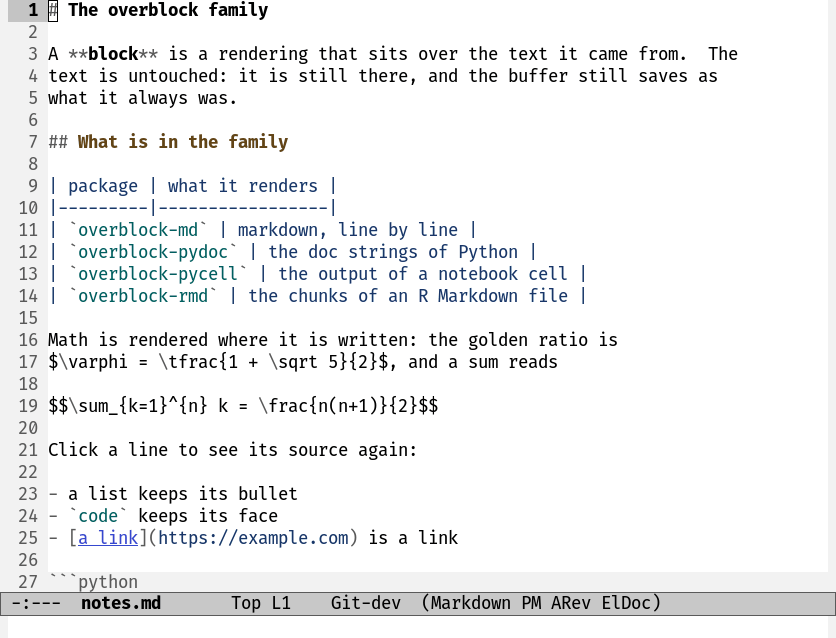

# Inspired by: https://github.com/othneildrew/Best-README-Template
#+OPTIONS: toc:nil

[[https://github.com/MArpogaus/pycell/graphs/contributors][https://img.shields.io/github/contributors/MArpogaus/pycell.svg?style=flat-square]]
[[https://github.com/MArpogaus/pycell/network/members][https://img.shields.io/github/forks/MArpogaus/pycell.svg?style=flat-square]]
[[https://github.com/MArpogaus/pycell/stargazers][https://img.shields.io/github/stars/MArpogaus/pycell.svg?style=flat-square]]
[[https://github.com/MArpogaus/pycell/issues][https://img.shields.io/github/issues/MArpogaus/pycell.svg?style=flat-square]]
[[https://github.com/MArpogaus/pycell/blob/main/COPYING][https://img.shields.io/github/license/MArpogaus/pycell.svg?style=flat-square]]
[[https://github.com/MArpogaus/pycell/actions/workflows/test.yml][https://img.shields.io/github/actions/workflow/status/MArpogaus/pycell/test.yml.svg?branch=main&label=tests&style=flat-square]]
[[https://linkedin.com/in/MArpogaus][https://img.shields.io/badge/-LinkedIn-black.svg?style=flat-square&logo=linkedin&colorB=555]]

* pycell :TOC_3_gh:noexport:
  - [[#about-the-project][About The Project]]
  - [[#getting-started][Getting Started]]
    - [[#prerequisites][Prerequisites]]
    - [[#installation][Installation]]
    - [[#example-configuration][Example Configuration]]
    - [[#scrolling][Scrolling]]
  - [[#usage][Usage]]
    - [[#results][Results]]
    - [[#markdown-cells][Markdown Cells]]
  - [[#commands][Commands]]
  - [[#customization][Customization]]
  - [[#known-limits][Known Limits]]
  - [[#comparison-with-other-packages][Comparison with Other Packages]]
  - [[#how-it-works][How It Works]]
  - [[#contributions][Contributions]]
  - [[#license][License]]
  - [[#contact][Contact]]

** About The Project

=pycell= shows the results of Python code cells in the buffer, in the
style of a notebook.  It needs no Jupyter kernel.

The package builds on [[https://github.com/astoff/code-cells.el][code-cells]] and [[https://github.com/astoff/comint-mime][comint-mime]].  It needs nothing
more than =python.el=.  There is no =emacs-jupyter=, no =zmq= module
and no =.ipynb= file.

Evaluate a cell, and the result appears below it: text, tables and
figures.  The =*Python*= buffer keeps the full log.  Markdown cells
render in place, and this includes the LaTeX fragments.

** Getting Started

*** Prerequisites

- Emacs 29.1 or later.
- [[https://github.com/astoff/code-cells.el][code-cells]] and [[https://github.com/astoff/comint-mime][comint-mime]].  Both are dependencies of the
  package.
- IPython for rich output.  A plain =python3= shell gives text only,
  because comint-mime installs its renderers through IPython.
- A converter from Markdown to HTML for the markdown cells.  pycell
  looks for =markdown=, =pandoc=, =markdown_py=, =cmark= and
  =cmark-gfm=, in this order.  See =pycell-markdown-command=.
- An Emacs with libxml2, because shr reads the HTML of the converter
  with it.  Without a converter or without libxml2 the markdown cells
  stay plain text.  The mode then reports which part is missing.
- =latex= and =dvipng= or =dvisvgm= for the formulas that your
  converter does not render.

*** Installation

Install from MELPA with the package manager of Emacs:

#+begin_src emacs-lisp
  (use-package pycell
    :ensure t)
#+end_src

*** Example Configuration

The configuration below is small and complete.  code-cells finds the
=# %%= cells in a plain Python file, and the hook turns =pycell-mode=
on with it.

The package installs no hook itself.  An installation must not change
how Emacs behaves.

#+begin_src emacs-lisp
  ;; Cells in plain Python files, with the "# %%" convention.
  (use-package code-cells
    :ensure t
    :hook (python-base-mode . code-cells-mode-maybe))

  (use-package pycell
    :ensure t
    :hook (code-cells-mode . pycell-mode-maybe)
    :custom
    ;; A block is one buffer line.  A long result therefore makes a
    ;; long jump.  Keep the inline part short.
    (pycell-max-lines 12)
    (pycell-markdown-command "pandoc -f gfm -t html"))

  ;; IPython gives rich output, if the project has one.
  (use-package python
    :ensure nil
    :custom
    (python-shell-interpreter "ipython")
    (python-shell-interpreter-args "-i --simple-prompt --no-color-info"))

  ;; The wheel moves through tall blocks with pixel scrolling only.
  (pixel-scroll-precision-mode 1)
#+end_src

Open a Python file with =# %%= cells and evaluate one cell with
=code-cells-eval=.  The result appears below the cell.  Turn
=pycell-mode= off, and the evaluation goes back to
=python-shell-send-region=.

*** Scrolling

The package does not change the scroll options.  With their default
values the window moves through the blocks in one direction, and
=make scroll= tests this.

Two settings are yours to make:

1. Turn pixel scrolling on.  Without it the wheel crosses a whole
   result block in one step.

   #+begin_src emacs-lisp
     (pixel-scroll-precision-mode 1)
   #+end_src

2. Keep =scroll-conservatively= at 100 or below.  Above 100 the
   redisplay must not recenter.  Two blocks that are taller than the
   window then hand the window from one to the other with each scroll
   event, without an end.  A =scroll-margin= of 1 or more also stops
   that loop.

** Usage

*** Results

Evaluate a cell with =code-cells-eval= or =code-cells-eval-and-step=.

The header bar shows a spinner and a stopwatch while the cell runs.
It shows the line count and the runtime after the cell.  A cell that
printed nothing keeps a header that says /no output/.  You can
therefore see which cells ran.

The header bar has buttons at its right:

| Button | Action                                 |
|--------+----------------------------------------|
| =▾=    | fold or unfold the result              |
| =⌃=    | move this cell up                      |
| =⌄=    | move this cell down                    |
| =⤓=    | save the image of the result to a file |
| =⧉=    | copy the result, with the images       |
| =↗=    | show the full result in its own buffer |
| =✕=    | discard the result                     |

The fold arrow stands at the left of the bar and the buttons at its
right, in the order of =pycell-result-buttons=.  A rendered markdown
cell carries the two move buttons, the edit button and the one that
shows its source.

=TAB= at the end of a cell also folds the result.  The header shows
=⚠= if the interpreter dies while the cell runs, and the result ends
with a note.

A table, a DataFrame among them, gets its columns laid out again for
the block: literal columns that stand where they are whatever face the
block wears.  =pycell-pop-output= gives you that table live, in its own
buffer, where every binding of vtable works: =S= or a click on a
column name sorts, ={= and =}= narrow and widen a column, and =M-left=
and =M-right= move one.

With =outline-minor-mode= a fold of the cell hides the code and keeps
the result below the heading.  The fold button of the result still
works there.  Code and output fold apart from each other.

A cell can hold syntax that only IPython reads: =%matplotlib inline=
and the other magics, =!ls= and =print?=.  jupytext files hold such
cells.  pycell sends such a cell to the reader of IPython, and it
runs as if you typed it.  Two things follow.  The tracebacks count
the lines from the top of the cell, and a shell without IPython
reports that it does not know =get_ipython=.

*** Markdown Cells

A cell with the marker =# %% [markdown]= renders in place.  The
rendering hangs on the commented source lines, one piece to a line.
The header bar takes the place of the word =[markdown]=, and the
=# %%= keeps the look of the other cell markers.

The cell moves as normal text, and an outline fold takes the whole
cell with it.  The cell keeps the height of its source.  It becomes
shorter if the rendering is shorter, for example a table of three
lines that renders as one line.  The spare lines then go under a
cloak.

A =$...$= or =$$...$$= fragment becomes a preview image.  The images
live in =~/.cache/pycell-math=.

An == draws the file it names, beside the notebook or
at an absolute path, capped by =pycell-max-image-height= like a result's
figure.  A terminal draws no image and shows the alt text instead.  A
link keeps its click: =RET= and =mouse-2= on a link, an image with a
link around it included, follow the URL.

=RET= or =mouse-2= opens the cell in a buffer of its own, as
=org-edit-special= does for a source block.  =C-c C-c= puts the text
back and renders it again.  =C-c C-k= discards the edit.  Each cell
has an edit buffer of its own, so you can open several cells at the
same time.  =mouse-1= shows the plain source of one cell.

** Commands

| Command                      | Action                                     |
|------------------------------+--------------------------------------------|
| =pycell-mode=                | turn the feature on or off for a buffer    |
| =pycell-toggle-output=       | fold or unfold the result at point         |
| =pycell-copy-output=         | copy the result at point                   |
| =pycell-pop-output=          | show the result at point in its own buffer |
| =pycell-save-image=          | write the image of the result to a file    |
| =pycell-discard-output=      | remove the result at point                 |
| =pycell-remove-overlays=     | remove each result in the buffer           |
| =pycell-interrupt=           | send a KeyboardInterrupt to the cell       |
| =pycell-restart=             | restart the interpreter, drop the results  |
| =pycell-restart-and-run-all= | restart, then run each cell in order       |
| =pycell-md-render-all=       | render each markdown cell                  |
| =pycell-md-unrender=         | show each markdown cell as source          |
| =pycell-md-edit=             | edit the markdown cell in its own buffer   |
| =pycell-md-raw=              | show one markdown cell as source           |
| =pycell-move-cell-up=        | move the cell at point up, with its result |
| =pycell-move-cell-down=      | move the cell at point down, likewise      |
| =pycell-stop=                | stop the run of the cells after this one   |

pycell binds none of these commands.  It binds the mouse actions and
=TAB= on the blocks only.  Bind the commands that you use, for
example in =code-cells-mode-map=.

** Customization

| Option                    | Meaning                                          |
|---------------------------+--------------------------------------------------|
| =pycell-max-lines=        | the result lines that show inline                |
| =pycell-max-line-length=  | the characters of a result line that show inline |
| =pycell-max-image-height= | the share of the window for an inline image      |
| =pycell-block-fringe=     | whether a block draws a bracket in the fringe    |
| =pycell-markdown-command= | the shell command from Markdown to HTML          |
| =pycell-result-buttons=   | the buttons on the header of a result            |
| =pycell-markdown-buttons= | the buttons on the header of a markdown cell     |
| =pycell-header=           | the face of the header bar                       |
| =pycell-output=           | the face of the result body                      |
| =pycell-md-code=          | the face of inline code in a markdown cell       |
| =pycell-block-fringe-face= | the face of the bracket in the fringe           |

Each entry of the two button options is =(KEY GLYPHS HELP COMMAND
WHEN)=.  GLYPHS are the candidates for the label: the first one your
frame can draw wins, and the last one always answers, so keep a plain
character at the end.  WHEN is =t=, or =image= for a button that waits
for an image in the result, or =lines= for one that waits for output.

Drop a button you never press, put them in another order, or give one
a glyph your font draws better:

#+begin_src emacs-lisp
  ;; no discard button, and a plain arrow for the move
  (setq pycell-result-buttons
        '((copy ("⧉" "≡") "Copy this result" pycell-copy-output lines)
          (move-up ("↑" "u") "Move this cell up" pycell-move-cell-up t)
          (move-down ("↓" "d") "Move this cell down" pycell-move-cell-down t)))
#+end_src

A command of your own can sit there as well: it is called with the
click, so read =last-input-event= as the commands of this package do.

** Known Limits

- A result block is one buffer line.  =next-line= and =previous-line=
  therefore cross it in one step.  The mouse wheel moves through it,
  see [[#scrolling][Scrolling]].  A markdown cell has a height in lines and moves as
  normal text.
- A result block with an image is harder to scroll through than a
  block of text.  The wheel does not cross it in a symmetric way, and
  =scroll-up-line= does not cross it at all.
  =pycell-max-image-height= keeps such a block small enough for the
  wheel.  Use =pycell-pop-output= for the full figure.
- One cell runs at a time for each inferior process.  pycell refuses
  a cell while another cell runs.
- A block shows a copy of what the shell rendered, with the columns of
  a table made literal so that they survive the move.  A DataFrame
  comes out aligned, and the header of one can stand a column left of
  its data.  A copy cannot be sorted: the buttons of the live table
  are gone rather than dead.
- A rendered markdown cell makes each scroll event more expensive,
  because rendered Markdown holds many face runs.  =M-x
  pycell-md-unrender= gives the plain source and the speed back for a
  buffer.
- The measurements behind these limits are in
  [[file:docs/implementation.org][docs/implementation.org]].

** Comparison with Other Packages

[[https://github.com/emacs-jupyter/jupyter][emacs-jupyter]] speaks the Jupyter protocol and needs the =zmq= module.
It gives you kernels for many languages and a notebook interface.
=pycell= uses the inferior Python process that =python.el= starts.
This costs one build dependency less and keeps the REPL in reach.

[[https://github.com/astoff/code-cells.el][code-cells]] gives the cells, the navigation and the evaluation
command.  =pycell= adds what happens to the output.

[[https://github.com/millejoh/emacs-ipython-notebook][EIN]] edits =.ipynb= files.  =pycell= works on plain Python files with
cell markers in the style of jupytext, and these files stay easy to
diff.

** How It Works

[[file:docs/implementation.org][docs/implementation.org]] describes the implementation: how a result
comes into the buffer, how the live mirror works, how a markdown cell
renders, and what the scroll measurements say.

** Development

=make= runs what the CI runs: byte-compilation with warnings as errors,
checkdoc, package-lint and the batch tests.  =make scroll= needs a
display and measures the scrolling.

The hooks of =.pre-commit-config.yaml= run the whitespace checks and
checkdoc before a commit, and the compilation and the tests before a
push:

#+begin_src shell
  pre-commit install --install-hooks -t pre-commit -t pre-push
#+end_src

The workflow of the same name runs them over every file, so a commit
made without the hooks is still checked.

** Contributions

Contributions are greatly appreciated!  Feel free to check the
[[https://github.com/MArpogaus/pycell/issues][issues page]] or submit a [[https://github.com/MArpogaus/pycell/pulls][pull request]].

** License

Distributed under the [[file:COPYING][GPLv3]] License.

** Contact

[[https://github.com/MArpogaus/][Marcel Arpogaus]] - [[mailto:znepry.necbtnhf@tznvy.pbz][znepry.necbtnhf@tznvy.pbz]] (encrypted with [[https://rot13.com/][ROT13]])
