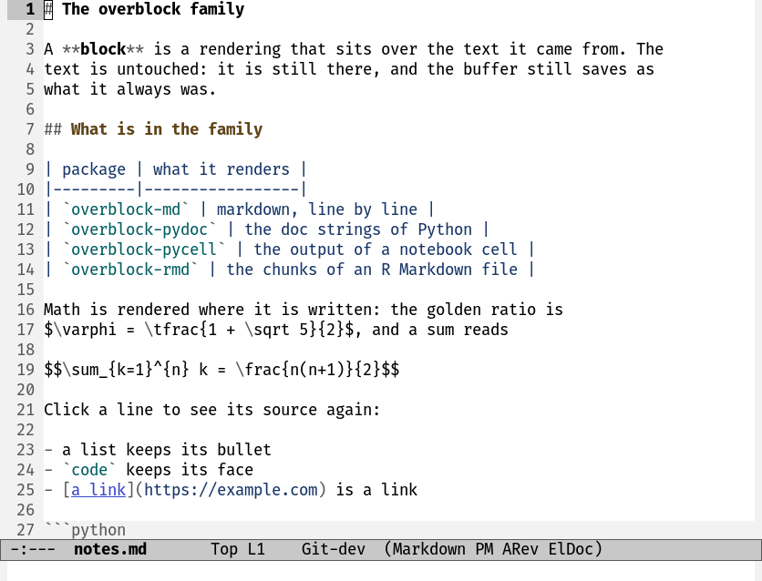
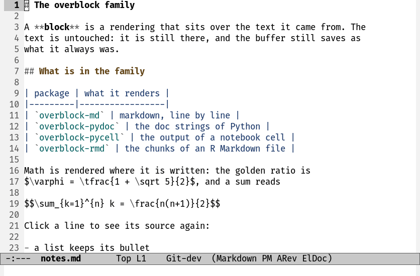
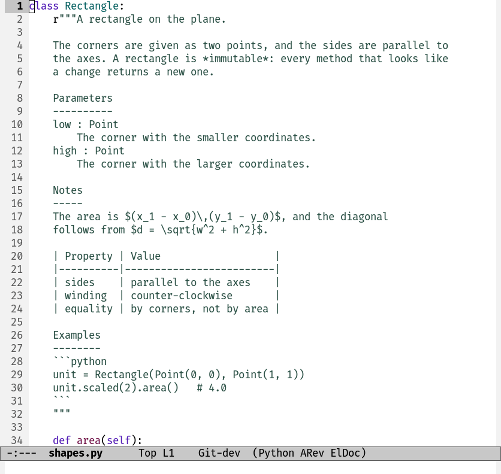
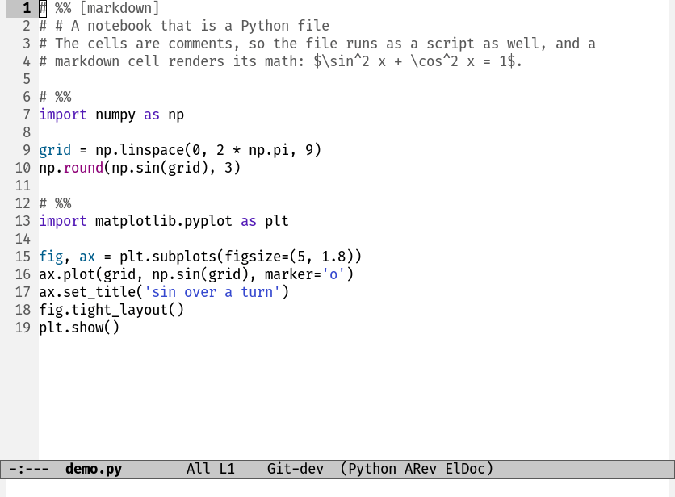
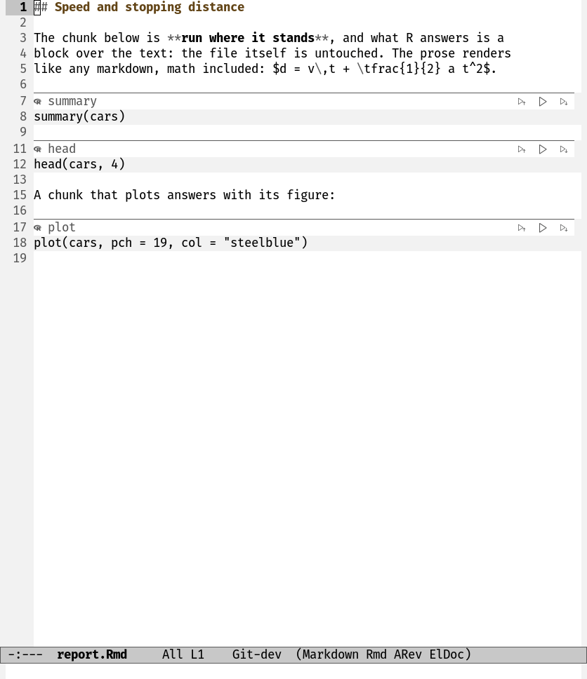

# Inspired by: https://github.com/othneildrew/Best-README-Template
#+OPTIONS: toc:nil

[[https://github.com/MArpogaus/overblock/graphs/contributors][https://img.shields.io/github/contributors/MArpogaus/overblock.svg?style=flat-square]]
[[https://github.com/MArpogaus/overblock/network/members][https://img.shields.io/github/forks/MArpogaus/overblock.svg?style=flat-square]]
[[https://github.com/MArpogaus/overblock/stargazers][https://img.shields.io/github/stars/MArpogaus/overblock.svg?style=flat-square]]
[[https://github.com/MArpogaus/overblock/issues][https://img.shields.io/github/issues/MArpogaus/overblock.svg?style=flat-square]]
[[https://github.com/MArpogaus/overblock/blob/main/COPYING][https://img.shields.io/github/license/MArpogaus/overblock.svg?style=flat-square]]
[[https://github.com/MArpogaus/overblock/actions/workflows/test.yml][https://img.shields.io/github/actions/workflow/status/MArpogaus/overblock/test.yml.svg?branch=main&label=tests&style=flat-square]]
[[https://linkedin.com/in/MArpogaus][https://img.shields.io/badge/-LinkedIn-black.svg?style=flat-square&logo=linkedin&colorB=555]]

* overblock :TOC_3_gh:noexport:
  - [[#about-the-project][About The Project]]
  - [[#which-one-do-you-want][Which One Do You Want]]
  - [[#overblock-the-block-layer][overblock: the block layer]]
  - [[#overblock-md-markup-rendered-to-text][overblock-md: markup rendered to text]]
  - [[#overblock-pydoc-python-doc-strings][overblock-pydoc: Python doc strings]]
  - [[#overblock-pycell-python-notebook-cells][overblock-pycell: Python notebook cells]]
  - [[#overblock-rmd-r-chunks-in-an-rmd-file][overblock-rmd: R chunks in an Rmd file]]
  - [[#prerequisites][Prerequisites]]
  - [[#known-limits][Known Limits]]
  - [[#development][Development]]
  - [[#contributions][Contributions]]
  - [[#use-of-llm-coding-tools][Use of LLM Coding Tools]]
  - [[#license][License]]
  - [[#contact][Contact]]

** About The Project

This repository holds five Emacs packages with one idea. A *block*
shows text over a region of a buffer, or after it. The buffer text does
not change, so files, undo and a language server see nothing.

A block that shows text over a region puts each rendered line on the
source line it came from. Thus a tall rendering scrolls like text and
does not jump past in one step.
The four modes render Markdown where it is written, and show Python doc
strings as documentation. They also show the output of a Python cell or
an R chunk under its code.



The animation shows the four modes in turn. It shows a Markdown file,
the doc strings of a Python module, a =# %%= notebook and an =.Rmd=
file. A real Emacs session recorded it with the setup in
[[file:demo/init.el][=demo/init.el=]]. [[file:demo/README.org][=demo/README.org=]]
tells how to record it again.

** Which One Do You Want

| Package            | What you get                                      | It needs                                         |
|--------------------+---------------------------------------------------+--------------------------------------------------|
| =overblock=        | the layer, a library for other packages           | Emacs 29.1                                       |
| =overblock-md=     | markup rendered to text, and a Markdown preview   | =overblock=, latex-to-svg-backend, markdown-mode |
| =overblock-pydoc=  | Python doc strings rendered in place              | =overblock=, =overblock-md=                      |
| =overblock-pycell= | inline results for =# %%= Python cells            | =overblock=, =overblock-md=, code-cells          |
| =overblock-rmd=    | inline results for the R chunks of an =.Rmd= file | =overblock=, =overblock-md=, ess, markdown-mode  |

No package is on MELPA yet. Thus a package manager cannot find the
packages of this repository by name. Each package that you use needs a
recipe of its own, and so does each package of this repository that it
needs. Declare them from the bottom up: =overblock= first, then
=overblock-md=, then the mode.

The snippets below are for [[https://github.com/progfolio/elpaca][elpaca]]
and =use-package=. Each recipe gives its package a clone of its own with
=:repo ("MArpogaus/overblock" . "NAME")=. Two packages in one clone
can make elpaca hang. Install the other dependencies, such as
latex-to-svg-backend or code-cells, as usual.

No package installs a hook or binds a key on the keyboard. Installing a
package does not change how Emacs behaves.

** overblock: the block layer

=overblock= shows blocks and knows nothing about a language, a cell or
markup. It also holds the run loop that the two notebooks share. It
shows nothing by itself, so install it when another package needs it:

#+begin_src emacs-lisp
  (use-package overblock
    :ensure (overblock :host github
                       :repo ("MArpogaus/overblock" . "overblock")
                       :files ("overblock.el" "overblock-repl.el"
                               "overblock-run.el")))
#+end_src

The API for a package that shows blocks is in
[[file:docs/overblock.org][docs/overblock.org]].
[[file:docs/custom-mode.org][docs/custom-mode.org]] tells how to write a
mode of your own, with two small example modes.

*** Options

These options apply to every package of the repository.

| Option                          | Default | Meaning                                          |
|---------------------------------+---------+--------------------------------------------------|
| =overblock-image-height=        |     0.8 | the share of the window for an inline image      |
| =overblock-terminal-glyphs=     |     nil | whether this terminal draws the icon glyphs      |
| =overblock-live-idle=           |     0.2 | the seconds of quiet before a mode renders again |
| =overblock-run-max-lines=       |      12 | the result lines that show inline                |
| =overblock-run-max-line-length= |    2000 | the characters of a result line that show inline |
| =overblock-run-scroll=          |       t | a pass scrolls until you type, scroll or click   |

A block that is taller than the window stops the wheel. Thus
=overblock-image-height= caps an inline image. Zero shows an image at
its own size, or at the size its tag gives. The two result limits
apply to every notebook, and zero shows all. Set the options with
=setopt=. A change of a result limit draws the results on the screen
again at once. A change of =overblock-image-height= or
=overblock-terminal-glyphs= applies to the next block that a mode
draws.

*** Faces

The face =overblock-bar= draws each bar, and =overblock-body= draws the
body of a result. Change a face with =set-face-attribute=:

#+begin_src emacs-lisp
  (set-face-attribute 'overblock-bar nil :overline nil)
#+end_src

*** Buttons

Each mode puts bars with buttons on the screen, and an option of the
mode holds the buttons. Each entry of such an option is
=(KEY GLYPHS HELP COMMAND WHEN)=:

- KEY names the entry.
- GLYPHS is a list of labels. The frame shows the first label that it
  can draw. Keep a plain word at the end, because each frame can draw
  the last label.
- HELP is the tooltip, and COMMAND runs on a click.
- WHEN says when the button shows. =t= shows it always, =image= with an
  image and =lines= with output. =running= shows it while the region
  runs, and =done= when the run has ended.

The first label of each button is a codicon from a nerd font. A
terminal shows the last label, unless =overblock-terminal-glyphs= is
=t=. This example removes the discard button of a notebook result.
Put such forms in the =:config= of the =use-package= form of the
package: at startup the package is not loaded yet, and its variables
do not exist.

#+begin_src emacs-lisp
  (setopt overblock-pycell-result-buttons
          (seq-remove (lambda (b) (eq (car b) 'discard))
                      overblock-pycell-result-buttons))
#+end_src

Use =setopt= and not =setq=. With =setopt=, the bars of every open
buffer change at once.

** overblock-md: markup rendered to text



=overblock-md= turns Markdown into one propertized string. A converter
writes HTML, and shr renders it. LaTeX formulas become images through
[[https://github.com/alberti42/latex-to-svg-backend][latex-to-svg-backend]].
The package also holds =overblock-md-preview-mode=, which shows a
Markdown buffer rendered over its own source.

#+begin_src emacs-lisp
  (use-package markdown-mode :ensure t)

  (use-package overblock-md
    :ensure (overblock-md :host github
                          :repo ("MArpogaus/overblock" . "overblock-md")
                          :files ("overblock-md.el"
                                  "overblock-md-preview.el"))
    :hook (markdown-mode . overblock-md-preview-mode))
#+end_src

The hook turns the preview on in each Markdown buffer. Without the
hook, use =M-x overblock-md-preview-mode=. The mode works only in a
buffer whose major mode derives from =markdown-mode=.

*** Markdown preview

The unit of the preview is a Markdown block. A block is the front
matter at the top of the file, a fenced code block, an HTML comment at
the left margin that comes after a blank line, a heading line or a
fence line, or the run of lines between two blank lines or fences. In
a Markdown file a comment that holds a blank line is a block of its
own. A fence indented under a list item is part of that item. A click on a rendered block shows its source, and a click on a
link opens the link. A URL with a scheme opens in the browser. A
relative path opens its file, and =#slug= moves to its heading, as on
GitHub.
Edit the source, and the block renders again when point leaves it. A
marked region also shows its source, so you copy or cut the source.

A fenced block that names its language, such as =```python=, gets the
font lock of that language. A local image shows in the buffer. An image
with a URL is fetched once and kept in the folder =overblock-images/=
of the XDG cache folder, =~/.cache= by default. =mouse-1= and =mouse-2=
both open a rendered link.

A formula renders in the buffer that shows it. Thus a LaTeX preamble
that you set for latex-to-svg-backend in =.dir-locals.el= applies. A
formula that fails stays text.

*** Documentation from a language server

eglot can render the documentation of a language server with this
package:

#+begin_src emacs-lisp
  (setopt eglot-documentation-renderer #'overblock-md-eglot-renderer)
#+end_src

Then a hover shows tables in columns, the signature in the colours of
its language, and formulas as images. This applies wherever eldoc shows
the text. =eglot-documentation-renderer= needs eglot 1.24 or later,
which Emacs 31 includes and GNU ELPA has for older Emacs versions.

*** Commands and options

| Command                              | Action                                      |
|--------------------------------------+---------------------------------------------|
| =overblock-md-preview-mode=          | turn the preview on or off                  |
| =overblock-md-preview-render-buffer= | render what is not rendered yet             |
| =overblock-md-forget-failed-images=  | try again the images that could not be read |
| =overblock-live-edit=                | show the source of the block at point       |

=overblock-live-map= holds only the click, for your own keys. The doc
strings and the prose of an Rmd file use the same map.

| Option                       | Default                        | Meaning                                 |
|------------------------------+--------------------------------+-----------------------------------------|
| =overblock-md-command=       | =pandoc=, then four candidates | the shell command from Markdown to HTML |
| =overblock-md-remote-images= | =t=                            | whether to fetch an image named by URL  |
| =overblock-md-code-modes=    | ten language names             | the major mode for a fenced block       |
| =overblock-md-eldoc-width=   | 72                             | the columns of a language server's text |

=overblock-md-command= is one shell command, or a list of candidates.
[[#prerequisites][Prerequisites]] gives the default list.

=overblock-md-code-modes= maps the language names that do not spell
their mode, such as =elisp=, =bash= and =r=. Each other name is tried as
=LANGUAGE-mode=. Set the option to nil, and each fenced block gets the
face =overblock-md-code=.

The face =overblock-md-code= draws inline code. Change it with
=set-face-attribute=, as for the faces of [[#faces][overblock]].

The details of the renderer are in
[[file:docs/overblock-md.org][docs/overblock-md.org]].

** overblock-pydoc: Python doc strings



=overblock-pydoc-mode= shows the doc strings of a Python buffer as
documentation. The quotes and the indentation go, the markup renders,
and the code stays as it is. A click on a doc string shows its source.
Point that moves into a doc string changes nothing.

The mode uses the faces of font lock to find the doc strings. Thus it
works in =python-mode= and in =python-ts-mode=, and a string that is
data stays as it is.

Declare the recipes of [[#overblock-the-block-layer][overblock]] and
[[#overblock-md-markup-rendered-to-text][overblock-md]] first. Leave out
the =:hook= of overblock-md where the preview is not wanted.

#+begin_src emacs-lisp
  (use-package overblock-pydoc
    :ensure (overblock-pydoc :host github
                             :repo ("MArpogaus/overblock" . "overblock-pydoc")
                             :files ("overblock-pydoc.el")))
#+end_src

Turn the mode on with =M-x overblock-pydoc-mode=. To turn it on in each
Python buffer, add it to =python-base-mode-hook=.

*** Commands and options

| Command                         | Action                                |
|---------------------------------+---------------------------------------|
| =overblock-pydoc-mode=          | turn the rendering on or off          |
| =overblock-pydoc-render-buffer= | render what is not rendered yet       |
| =overblock-pydoc-edit=          | edit the doc string in its own buffer |
| =overblock-live-edit=           | show the source of one doc string     |

=overblock-pydoc-edit= opens the prose without the quotes and the
indentation. =C-c C-c= (=overblock-edit-commit=) writes it back, and
=C-c C-k= (=overblock-edit-abort=) discards it. The commit puts the
closing quotes of a doc string with several lines on a line of their
own, as PEP 257 says.

=overblock-live-map= holds only the click, as in the Markdown preview.

| Option                        | Default                       | Meaning                                |
|-------------------------------+-------------------------------+----------------------------------------|
| =overblock-pydoc-markup=      | =markdown=                    | the markup of the doc strings          |
| =overblock-pydoc-command=     | a =pandoc= command per markup | the shell command for a doc string     |
| =overblock-pydoc-modes=       | =rst-mode=, =markdown-mode=   | the major mode of the edit buffer      |
| =overblock-pydoc-bar-buttons= | one edit button               | the buttons on the bar of a doc string |

=overblock-pydoc-markup= selects the command and the edit mode. The
default is Markdown, as in a numpy style doc string that mkdocstrings
reads. A Sphinx project writes reStructuredText. Set the markup for
such a project in =.dir-locals.el=:

#+begin_src emacs-lisp
  ;;; .dir-locals.el
  ((python-base-mode . ((overblock-pydoc-markup . rst))))
#+end_src

The face =overblock-pydoc-footer= draws the rule under a doc string.
Change it with =set-face-attribute=, as for the faces of
[[#faces][overblock]].

For the button format, see [[#buttons][Buttons]]. The details are in
[[file:docs/overblock-pydoc.org][docs/overblock-pydoc.org]].

** overblock-pycell: Python notebook cells



=overblock-pycell= shows the results of Python cells in the buffer, as
a notebook does. It needs no Jupyter kernel. The cells go to the Python
interpreter of =python.el=, so the =*Python*= buffer keeps the full
log. The files stay plain Python with =# %%= markers, as jupytext
writes them.

Declare the recipes of [[#overblock-the-block-layer][overblock]] and
[[#overblock-md-markup-rendered-to-text][overblock-md]] first. Leave out
the =:hook= of overblock-md where the preview is not wanted.

#+begin_src emacs-lisp
  ;; Cells in plain Python files, with the "# %%" convention.
  (use-package code-cells
    :ensure t
    :hook (python-base-mode . code-cells-mode-maybe))

  ;; Figures and tables in the output.
  (use-package comint-mime
    :ensure t
    :hook (inferior-python-mode . comint-mime-setup))

  (use-package overblock-pycell
    :ensure (overblock-pycell :host github
                              :repo ("MArpogaus/overblock" . "overblock-pycell")
                              :files ("overblock-pycell.el"))
    :hook (code-cells-mode . overblock-pycell-mode-maybe))

  ;; IPython gives rich output. Leave out this form where IPython is
  ;; not installed: a plain python3 gives text only.
  (use-package python
    :ensure nil
    :custom
    (python-shell-interpreter "ipython")
    (python-shell-interpreter-args "-i --simple-prompt --no-color-info"))
#+end_src

Open a Python file with =# %%= cells, and run a cell with
=code-cells-eval=. The result shows below the cell. Turn
=overblock-pycell-mode= off, and the blocks go. Then =code-cells-eval=
uses =python-shell-send-region= again.

*** Cells

A bar stands in place of each =# %%= line. The bar shows the name that
you write after the marker. A cell without a name is /python/. These are
the buttons of =overblock-pycell-bar-buttons=:

| Button | Command                           | Action                       |
|--------+-----------------------------------+------------------------------|
| =⇈=    | =overblock-run-above=             | run each cell above this one |
| =▷=    | =overblock-run-this=              | run this cell                |
| =⇊=    | =overblock-run-below=             | run this cell and each below |
| =⌃=    | =overblock-pycell-move-cell-up=   | move this cell up            |
| =⌄=    | =overblock-pycell-move-cell-down= | move this cell down          |

A button acts on the cell of its bar. The line under the bar is still
there. Point can go on it, and the bar follows what you write. Folding
works from that line.

*** Results

The bar of a result shows a spinner and a stopwatch while the cell
runs. After the run it shows the line count and the time. A cell that
fails shows =error= on its bar. A cell that printed nothing shows /no
output/. The bar shows =⚠= when the interpreter stops during the run.

The fold arrow =▾= is at the left of the bar, and the buttons of
=overblock-pycell-result-buttons= are at the right:

| Button | Command                        | Action                                 |
|--------+--------------------------------+----------------------------------------|
| =▾=    | =overblock-run-toggle-output=  | fold or unfold the result              |
| =□=    | =overblock-run-interrupt=      | interrupt this cell, and stop the pass |
| =↧=    | =overblock-run-save-image=     | save the image of the result to a file |
| =◫=    | =overblock-run-copy-output=    | copy the result, with the images       |
| =↗=    | =overblock-run-pop-output=     | show the full result in its own buffer |
| =✕=    | =overblock-run-discard-output= | discard the result                     |

The move buttons =⌃= and =⌄= of [[#cells][Cells]] come after them. The
interrupt button shows while the cell runs, and the discard button
when the run has ended.

=overblock-run-pop-output= opens the result in a buffer of its own. A
table there is a live vtable, so you can sort it with =S=. The buffer
follows a cell that still runs. =overblock-run-interrupt= and
=overblock-run-stop= also work in that buffer.

=overblock-run-interrupt= stops the cell and the cells queued after
it. =overblock-run-stop= lets the cell finish and empties the queue. A
pass over several cells stops at the first error. At the end of a
pass, the echo area says =overblock-pycell: done=, or
=overblock-pycell: stopped at error= after a cell that failed. An
interrupt says =overblock-pycell: interrupted=, with the number of
cells it left unrun. A pass that ends with done, and scrolled to
its end, puts point and the view back where you asked for it. A failed
cell leaves them on that cell. The interrupt button leaves the view
where it is. A key you press in the notebook during a pass, a stop key
too, gives point and the view back and acts there, not at the cell
that runs. A scroll or a click in the notebook moves on from the view
you see, and stops the scrolling. A cell you ask for while another
runs, or while the interpreter starts, waits its turn. The echo area
then says =overblock-pycell: this cell queued=, or =N cells queued=
for a pass, which counts its markdown cells too.

A cell can hold IPython syntax, such as =%matplotlib inline=, =!ls= or
=print?=. Such a cell goes to IPython as it is. Its tracebacks count
lines from the top of the cell. An interpreter without IPython cannot
run it.

*** Markdown cells

A cell with the marker =# %% [markdown]= renders in place. Its bar shows
/markdown/ and the buttons of =overblock-pycell-md-buttons=. =✎= edits
the cell in its own buffer. The move buttons =⌃= and =⌄= come after it.
A click (=mouse-1= or =mouse-2=) on a rendered link opens it. On
other text, =mouse-1= shows the source, and =mouse-2= opens the edit
buffer. =overblock-md-follow-link= opens a link from the keyboard.

A markdown cell that shows its source has a bar with the buttons of
=overblock-pycell-source-buttons=. Its =⟳= button renders the cell.

The Markdown features are those of
[[#overblock-md-markup-rendered-to-text][overblock-md]].

*** Commands

| Command                             | Action                                                                         |
|-------------------------------------+--------------------------------------------------------------------------------|
| =overblock-pycell-mode=             | turn the mode on or off for a buffer                                           |
| =overblock-pycell-mode-maybe=       | a hook function: the same, in a Python buffer only, for =code-cells-mode-hook= |
| =overblock-run-restart=             | restart with the environment of the notebook, and remove the results           |
| =overblock-run-restart-and-run-all= | restart, then run each cell in order                                           |
| =overblock-run-above=               | run each cell above this one                                                   |
| =overblock-run-below=               | run this cell and each cell below it                                           |
| =overblock-run-stop=                | stop the pass after the cell that runs now                                     |
| =overblock-run-clear-results=       | remove each result                                                             |
| =overblock-pycell-render-buffer=    | render each markdown cell that is not rendered                                 |
| =overblock-pycell-md-render-cell=   | render the markdown cell at point                                              |
| =overblock-live-edit=               | show the source of the markdown cell at point                                  |
| =overblock-pycell-md-edit=          | edit the markdown cell in its own buffer                                       |
| =overblock-md-follow-link=          | follow a link of the rendered cell                                             |


The package binds only the mouse on its bars and blocks. These keymaps
bind no key, so you can bind your own. The edit buffer of a markdown
cell uses =overblock-edit-mode-map=, with =C-c C-c= and =C-c C-k=.

| Map                         | Where it answers                   |
|-----------------------------+------------------------------------|
| =overblock-pycell-mode-map= | the notebook, while the mode is on |
| =overblock-run-result-map=  | inside a cell that shows a result  |
| =overblock-run-pop-map=     | a result in its own buffer         |
| =overblock-pycell-md-map=   | a rendered markdown cell           |

The parent of =overblock-run-pop-map= is =special-mode-map=, so =q=
quits the buffer of a result. As for the [[#buttons][buttons]], put the
keys in the =:config= of the package.

#+begin_src emacs-lisp
  (keymap-set overblock-pycell-mode-map "C-c C-k" #'overblock-run-interrupt)
  (keymap-set overblock-pycell-mode-map "C-c C-q" #'overblock-run-stop)
  (keymap-set overblock-run-pop-map "i" #'overblock-run-interrupt)
  ;; TAB at the end of a cell folds its result, and does its usual work
  ;; elsewhere.
  (keymap-set overblock-run-result-map "TAB"
              '(menu-item "" overblock-run-toggle-output
                          :filter overblock-run-tab-filter))
#+end_src

*** Options

| Option                            | Default       | Meaning                                    |
|-----------------------------------+---------------+--------------------------------------------|
| =overblock-pycell-result-buttons= | seven buttons | the buttons on the bar of a result         |
| =overblock-pycell-bar-buttons=    | five buttons  | the buttons on the bar of a code cell      |
| =overblock-pycell-md-buttons=     | three buttons | the buttons on a rendered markdown cell    |
| =overblock-pycell-source-buttons= | three buttons | the buttons on an unrendered markdown cell |

For the button format, see [[#buttons][Buttons]]. The result limits are
the options of [[#overblock-the-block-layer][overblock]].

*** Comparison with other packages

- [[https://github.com/emacs-jupyter/jupyter][emacs-jupyter]] uses the
  Jupyter protocol and the =zmq= module, with kernels for many
  languages. =overblock-pycell= uses the Python interpreter of
  =python.el=.
- [[https://github.com/astoff/code-cells.el][code-cells]] gives the
  cells and the commands. =overblock-pycell= adds the output.
- [[https://github.com/millejoh/emacs-ipython-notebook][EIN]] edits
  =.ipynb= files. =overblock-pycell= edits plain Python files, which
  are easy to diff.

The details are in
[[file:docs/overblock-pycell.org][docs/overblock-pycell.org]].

** overblock-rmd: R chunks in an Rmd file



=overblock-rmd-mode= runs the R chunks of an =.Rmd= file and shows the
output under each chunk. The prose between the chunks renders as in
=overblock-md-preview-mode=. There is no knitr run. The chunks go to
the R interpreter of ESS, so the R buffer keeps the full log.

Declare the recipes of [[#overblock-the-block-layer][overblock]] and
[[#overblock-md-markup-rendered-to-text][overblock-md]] first. Leave out
the =:hook= of overblock-md where the preview is not wanted.

Add =:mode ("\\.[rR]md\\'" . markdown-mode)= to the markdown-mode form
of overblock-md. That line opens an =.Rmd= file in =markdown-mode=.
Without use-package, add =("\\.[rR]md\\'" . markdown-mode)= to
=auto-mode-alist=. =poly-markdown+r-mode= of polymode also works.

#+begin_src emacs-lisp
  (use-package overblock-rmd
    :ensure (overblock-rmd :host github
                           :repo ("MArpogaus/overblock" . "overblock-rmd")
                           :files ("overblock-rmd.el"))
    :hook (markdown-mode . overblock-rmd-mode-maybe))
#+end_src

=overblock-rmd-mode-maybe= turns the mode on in a buffer whose file ends
in =.Rmd= or =.rmd=, and does nothing in other buffers. The mode works
only in a buffer whose major mode derives from =markdown-mode=. It
turns =overblock-md-preview-mode= off, because it renders the prose itself.

*** Chunks

A bar stands in place of the fence line of each =```{r}= chunk. The bar
shows the chunk name that knitr reads, so =```{r plot-one, echo=FALSE}=
shows /plot-one/. The buttons of =overblock-rmd-bar-buttons= are =⇈=,
which runs each chunk above this one, =▷=, which runs this chunk, and
=⇊=, which runs this chunk and each one below it. Like knitr, a pass
skips a chunk with =eval=FALSE= or =#| eval: false=. =▷= still runs it.

The closing fence is hidden, and the file does not change. A chunk of
another engine, such as =```{python}=, stays as it is. The bars show
when you stop typing.

*** Results

A result works as in [[#results][overblock-pycell]]: the same bar, the
same pop-out buffer and the same commands. =overblock-rmd-result-buttons=
holds the first five buttons of a Python result: stop, save, copy, pop
and discard.

A chunk that plots shows its figure under the output. The size comes
from =fig.width=, =fig.height= and =dpi= in the chunk header, as with
knitr. Each must be a plain number. A chunk without them uses
=overblock-rmd-figure-size= at 96 dots per inch.

A chunk goes to R as one statement. Thus a syntax error names =<text>=
and counts lines from the top of the chunk.

An interrupt stops the pass, and the result keeps what the chunk printed
before it.

*** Commands and options

| Command                             | Action                                                    |
|-------------------------------------+-----------------------------------------------------------|
| =overblock-rmd-mode=                | turn the mode on or off for a buffer                      |
| =overblock-rmd-mode-maybe=          | the same, in an =.Rmd= buffer only, for a major mode hook |
| =overblock-run-this=                | run the chunk at point                                    |
| =overblock-run-and-step=            | run the chunk at point, and move to the next              |
| =overblock-run-forward=             | move to the next chunk                                    |
| =overblock-run-backward=            | move to the previous chunk                                |
| =overblock-run-restart=             | restart R, and remove the results                         |
| =overblock-run-restart-and-run-all= | restart, then run each chunk in order                     |
| =overblock-live-edit=               | show the source of the prose at point                     |
| =overblock-rmd-render-buffer=       | render the prose that is not rendered yet                 |

The commands of a result and of a pass are those of
[[#results][overblock-pycell]].

The package binds only the mouse on its bars and blocks.
=overblock-rmd-mode-map= answers in the buffer, and
=overblock-run-result-map= in a chunk with a result. Both are empty.
Put the keys in the =:config= of the package:

#+begin_src emacs-lisp
  (keymap-set overblock-rmd-mode-map "C-<return>" #'overblock-run-this)
  (keymap-set overblock-rmd-mode-map "S-<return>" #'overblock-run-and-step)
  (keymap-set overblock-rmd-mode-map "C-c C-k" #'overblock-run-interrupt)
  (keymap-set overblock-rmd-mode-map "C-c C-q" #'overblock-run-stop)
#+end_src

| Option                         | Default   | Meaning                                     |
|--------------------------------+-----------+---------------------------------------------|
| =overblock-rmd-figure-size=    | =(7 . 5)= | the width and height of a figure, in inches |
| =overblock-rmd-bar-buttons=    | three     | the buttons on the bar of a chunk           |
| =overblock-rmd-result-buttons= | five      | the buttons on the bar of a result          |

For the button format, see [[#buttons][Buttons]]. The details are in
[[file:docs/overblock-rmd.org][docs/overblock-rmd.org]].

** Prerequisites

- Emacs 29.1 or later. =overblock= needs nothing more.
- For each package that renders markup:
  - A converter from Markdown to HTML. The candidates of
    =overblock-md-command= are =pandoc --mathjax --no-highlight
    --wrap=none -f markdown-implicit_figures=, =markdown_py -x tables
    -x fenced_code=, =cmark-gfm -e table=, =markdown= and =cmark=. The
    first one on =exec-path= is used.
  - An Emacs with libxml2, because shr reads the HTML with it.
  - Without a converter or without libxml2, the text stays as it is.
  - =latex= and =dvisvgm= for the formulas, which latex-to-svg-backend
    runs.
- =overblock-pydoc= needs =pandoc=, because both commands of
  =overblock-pydoc-command= are pandoc commands.
- [[https://github.com/jrblevin/markdown-mode][markdown-mode]] is
  necessary for =overblock-md-preview-mode= and =overblock-rmd-mode=.
  They refuse other major modes. =overblock-pydoc= opens a Markdown doc
  string in =markdown-mode=, or in =text-mode= without it.
- =overblock-pycell= needs
  [[https://github.com/astoff/code-cells.el][code-cells]]. Text output
  needs nothing more. Images and tables need
  [[https://github.com/astoff/comint-mime][comint-mime]] and IPython.
  A plain =python3= interpreter gives text only.
- =overblock-rmd= needs [[https://ess.r-project.org/][ESS]] and an R.
- A nerd font for the icons on the bars. Without one, each button shows
  a plain character or a word.

** Known Limits

These limits apply to each package, unless a limit names one.

- A bar is cut to the narrowest window that shows its buffer. A narrow
  side window beside a wide one cuts each label in both.
- A text shown after a region is one buffer line. =next-line= crosses it
  in one step. A text shown over a region keeps its lines, and moves as
  normal text.
- The wheel is less smooth through a block with an image than through a
  block of text. =scroll-up-line= does not pass such a block.
  =scroll-up=, =scroll-down=, =next-line= and a fold pass it.
- A rendering makes scrolling slower, because rendered markup holds
  many face runs. Turn the mode off to get the speed back.
- Without =pixel-scroll-precision-mode=, the wheel crosses a result in
  one step.
- With =scroll-conservatively= above 100, two blocks taller than the
  window can pass the window between them with no end. Keep it at 100
  or below, or set =scroll-margin= to 1 or more.
- On Emacs 29, the wheel can move the window back a little after a
  block taller than the window. Emacs 30 does not do this.
- The last cell of a notebook gets a final newline if it has none. This
  is the only change =overblock-pycell= makes to the text.
- Under polymode with =overblock-rmd-mode= on, the keymap of ESS does
  not work inside a chunk. Bind your keys in =overblock-rmd-mode-map=.
- At a text scale of -2 or below, the bar of a doc string can run a few
  pixels past the edge of the window.
- One converter run renders all blocks of a buffer. A footnote of
  Markdown therefore shows under the last block of the run, and its
  definition stays as source.
- In an =.Rmd= file an HTML comment is no block of its own, because a
  chunk inside it still runs. A paragraph with blank lines above and
  below it in a comment shows as text. Keep a comment in an Rmd file to
  one paragraph.
- A table column aligned with =:---:= or =---:= shows left aligned,
  because shr reads no cell style.

For the two notebooks:

- One region runs at a time for each interpreter. A region sent while
  another runs, or while the interpreter starts, waits in the queue.
- A table in a result is a copy with the columns as plain text. Thus
  the header can stand one column left of its data, and you cannot
  sort the copy. Sort the table in the buffer of
  =overblock-run-pop-output=.

** Development

=make= runs what the CI runs: byte compilation with warnings as errors,
package-lint, relint and the batch tests. =make test STRICT=1= fails
when a test would skip for a missing tool: a Markdown converter,
markdown-mode, vtable, libxml2 or =sh=. =make test-live= runs the
tests against a real IPython, R and bash, and skips each one that is
not installed. =make scroll= needs a display and tests the scrolling.

Install the hooks of =.pre-commit-config.yaml=:

#+begin_src shell
  pre-commit install --install-hooks -t pre-commit -t commit-msg -t pre-push
#+end_src

Before a commit, the hooks check the indentation, the documentation
strings, the declarations and the complexity of each function. Most of
them come from
[[https://github.com/MArpogaus/emacs-pre-commit-hooks][emacs-pre-commit-hooks]].
Before a push, they run package-lint, the compilation and the tests. A
workflow runs the same hooks on each push.

The notes of each package are in =docs/=, one file for each package.
[[file:docs/overblock.org][docs/overblock.org]] holds the API of the
layer and the run loop.

** Contributions

Contributions are welcome. See the
[[https://github.com/MArpogaus/overblock/issues][issues page]], or open a
[[https://github.com/MArpogaus/overblock/pulls][pull request]].

** Use of LLM Coding Tools

A large language model (LLM) coding assistant helped to write parts of
these packages. A person reviewed and tested each change before the
commit.

** License

Distributed under the [[file:COPYING][GPLv3]] License.

** Contact

[[https://github.com/MArpogaus/][Marcel Arpogaus]] - [[mailto:znepry.necbtnhf@tznvy.pbz][znepry.necbtnhf@tznvy.pbz]] (encrypted with [[https://rot13.com/][ROT13]])
